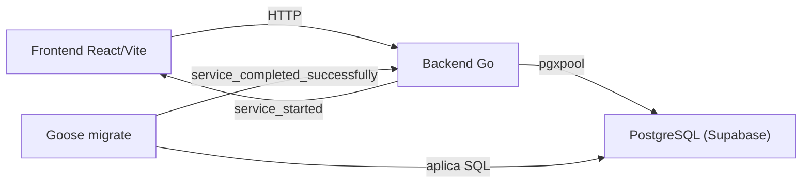
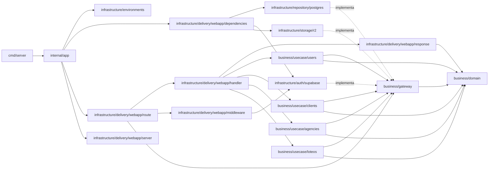

# Arquitectura y estructura

## Objetivo

LoteosAPP sigue una arquitectura modular por funcionalidad. Se aplican los
principios útiles de Clean Architecture —límites claros, dependencias hacia el
negocio y adaptadores reemplazables— sin crear capas o abstracciones que todavía
no aporten valor.

Las prioridades son:

- claridad del código;
- facilidad para localizar y modificar una funcionalidad;
- reglas del negocio independientes de HTTP, PostgreSQL y React;
- dependencias explícitas y simples de probar;
- crecimiento incremental, sin infraestructura anticipada.

## Vista general



## Backend

### Estructura objetivo

```text
apps/backend/
├── cmd/
│   ├── server/
│   │   └── main.go
│   └── migrate/
│       └── main.go
├── internal/
│   ├── app/
│   │   └── app.go
│   ├── business/
│   │   ├── domain/
│   │   │   ├── object.go
│   │   │   ├── cliente.go
│   │   │   ├── agency.go
│   │   │   └── usuario.go
│   │   ├── gateway/
│   │   │   ├── object_storage.go
│   │   │   ├── usuario_repository.go
│   │   │   ├── cliente_repository.go
│   │   │   ├── agency_repository.go
│   │   │   ├── loteo_repository.go
│   │   │   └── gatewayfake/
│   │   │       ├── object_storage.go
│   │   │       ├── user_repository.go
│   │   │       ├── cliente_repository.go
│   │   │       ├── agency_repository.go
│   │   │       └── loteo_repository.go
│   │   └── usecase/
│   │       ├── users/
│   │       │   └── create_user.go
│   │       ├── clients/
│   │       │   ├── create_client.go
│   │       │   ├── list_clients.go
│   │       │   ├── update_client.go
│   │       │   └── delete_client.go
│   │       ├── agencies/
│   │       │   ├── create_agency.go
│   │       │   ├── list_agencies.go
│   │       │   ├── update_agency.go
│   │       │   └── delete_agency.go
│   │       └── loteos/
│   │           ├── create_loteo.go
│   │           ├── list_loteos.go
│   │           ├── get_loteo.go
│   │           ├── store_loteo_dxf.go
│   │           ├── update_lote.go
│   │           ├── visibility.go
│   │           └── errors.go
│   └── infrastructure/
│       ├── environments/
│       │   └── config.go
│       ├── auth/
│       │   └── supabase/
│       │       ├── admin.go
│       │       └── verifier.go
│       ├── repository/
│       │   └── postgres/
│       │       ├── pool.go
│       │       ├── usuario.go
│       │       ├── cliente.go
│       │       ├── agency.go
│       │       ├── loteo.go
│       │       └── geometry.go
│       ├── storage/
│       │   └── r2/
│       │       └── client.go
│       └── delivery/
│           └── webapp/
│               ├── dependencies/
│               │   └── dependencies.go
│               ├── dto/
│               │   ├── users/
│               │   │   └── create_user.go
│               │   ├── clients/
│               │   │   ├── create_client.go
│               │   │   ├── list_clients.go
│               │   │   └── update_client.go
│               │   ├── agencies/
│               │   │   ├── create_agency.go
│               │   │   ├── list_agencies.go
│               │   │   └── update_agency.go
│               │   └── loteos/
│               │       ├── create_loteo.go
│               │       ├── list_loteos.go
│               │       ├── store_loteo_dxf.go
│               │       └── update_lote.go
│               ├── handler/
│               │   ├── create_user.go
│               │   ├── create_agency.go
│               │   ├── list_agencies.go
│               │   ├── update_agency.go
│               │   ├── delete_agency.go
│               │   ├── create_loteo.go
│               │   ├── list_loteos.go
│               │   ├── get_loteo.go
│               │   ├── store_loteo_dxf.go
│               │   └── update_lote.go
│               ├── middleware/
│               │   └── auth.go
│               ├── response/
│               │   └── json.go
│               ├── route/
│               │   └── route.go
│               └── server/
│                   ├── server.go
│                   └── cors.go
├── Dockerfile.dev
├── go.mod
└── go.sum
```

Esta estructura se adoptará incrementalmente. No es necesario crear directorios
vacíos antes de que exista una funcionalidad que los necesite.

### Responsabilidades

- `cmd/server`: inicia el proceso, recibe señales y delega la construcción de la
  aplicación. Debe contener muy poca lógica.
- `cmd/migrate`: ejecuta las migraciones y termina.
- `internal/app`: composition root y ciclo de vida del proceso. Al iniciar, lee
  la configuración (`environments`), pide a `dependencies` el grafo de
  objetos ya armado, registra las rutas y construye el `*http.Server`. Además
  sirve requests y apaga todo de forma ordenada ante una señal de cierre.
- `internal/infrastructure/delivery/webapp/dependencies`: contenedor de
  inyección de dependencias (IoC). Recibe lo que necesita desde `internal/app`
  (por ejemplo la cadena de conexión) y arma el grafo repositorio → servicio →
  handler, listo para usar. No conoce configuración, rutas ni el servidor
  HTTP; eso es responsabilidad de `internal/app`.
- `internal/business/domain`: entidades y tipos de valor del negocio, sin
  depender de HTTP ni de PostgreSQL.
- `internal/business/gateway`: contratos (interfaces) que el negocio necesita de
  sus adaptadores, como `UserRepository` e `IdentityProvider`. Los casos de uso
  dependen de estos contratos, nunca de una implementación concreta.
  `gateway/gatewayfake` contiene fakes de esos contratos para tests, ubicados
  junto a las interfaces que implementan en vez de duplicarse en cada paquete
  de `usecase`.
- `internal/business/usecase`: casos de uso que orquestan el dominio a través de
  los contratos de `gateway`, agrupados en subpaquetes por funcionalidad
  (`usecase/users`, `usecase/clients`, `usecase/loteos`). Cada caso de uso es
  una interfaz de un solo método `Execute` junto con su implementación,
  definidas en el mismo archivo (por ejemplo `usecase/users/create_user.go`).
- `internal/infrastructure/environments`: carga de configuración desde
  variables de entorno.
- `internal/infrastructure/auth/supabase`: valida el JWT (Bearer token)
  emitido por Supabase Auth contra el JWKS del proyecto y extrae el `sub`,
  el email y el rol de dominio leído de `app_metadata.role`. También
  implementa `gateway.IdentityProvider` contra la Admin REST API de
  Supabase (alta/baja de usuarios), autenticándose con la `service_role`
  key. Los 5 roles de dominio (`administrador`, `administrativo`,
  `agrimensor`, `escribano`, `inmobiliaria`, ver `internal/business/domain`)
  son los mismos que tenía el realm de Keycloak: no hubo remapeo de nombres
  al migrar, solo cambio de transporte (`realm_access.roles` en el JWT de
  Keycloak → `app_metadata.role`, un único string, en el de Supabase).
- `internal/infrastructure/delivery/webapp/middleware`: adapta la
  validación de `auth/supabase` a un middleware HTTP; rechaza requests sin
  token válido y expone el llamador autenticado al resto de la request.
  También expone `RequireActiveAccount`, que corre detrás de `RequireAuth` en
  toda la API y rechaza con 403 a un caller cuya fila en `usuarios` tenga
  `fecha_baja` seteado — necesario porque la validación del token es
  stateless (contra el JWKS, sin ida y vuelta a Supabase), así que un token
  ya emitido seguiría siendo válido hasta expirar aunque la cuenta esté dada
  de baja. Un caller sin fila en `usuarios` también es rechazado (403,
  `actor_not_provisioned`), salvo el caso puntual de bootstrap: un
  administrador provisionado solo en Supabase, identificado por el claim de
  rol del propio token, no por la fila ausente. Recibe el repositorio de
  usuarios a través de una interfaz chica definida en el propio paquete, no
  de `business/gateway`.
- `internal/infrastructure/repository/postgres`: implementa los contratos de
  persistencia (`gateway.UserRepository`) con `pgxpool` y SQL explícito, y
  expone la apertura y configuración del pool de conexiones.
- `internal/infrastructure/storage/r2`: implementa `gateway.ObjectStorage`
  contra Cloudflare R2 a través de su API S3, con el SDK de AWS v2. Guarda,
  lee y borra los archivos que sube el usuario (el DXF original del alta de
  loteo, fotos y planos). Ver [almacenamiento de archivos](#almacenamiento-de-archivos).
- `internal/infrastructure/delivery/webapp/dto`: structs de request/response
  HTTP, agrupados por feature (`dto/users`, `dto/clients`, `dto/loteos`)
  igual que `usecase`. Cada subpaquete declara `package dto`; como el
  identificador de paquete no tiene que coincidir con el nombre del
  directorio, no choca con `usecase/users`, `usecase/clients` ni
  `usecase/loteos` al importarse en el mismo archivo de `handler`.
- `internal/infrastructure/delivery/webapp/handler`: adapta requests HTTP a
  llamadas del caso de uso, decodificando y codificando los tipos de `dto`, y
  convierte el resultado en una respuesta. Cada ruta tiene su propio handler
  independiente, con un único caso de uso como dependencia (por ejemplo
  `CreateUserHandler` sólo conoce `users.CreateUser`); no hay un handler
  compartido que agrupe varias rutas. Un handler implementa `HTTPHandler`
  (`Handle(w, r) error`) en vez de escribir su propia respuesta de error: el
  error del caso de uso (o de `decodeJSON`) simplemente se retorna, y
  `Adapt(h, timeout)` lo convierte en `http.HandlerFunc` llamando a
  `response.WriteError`. `Adapt` también acota `r.Context()` al `timeout`
  antes de llamar a `Handle`, así que ningún handler arma su propio
  `context.WithTimeout`; usa `request.Context()` directo. Un handler sin
  ningún error posible queda como función suelta, sin envolverlo en un
  struct solo para cumplir la interfaz.
- `internal/infrastructure/delivery/webapp/response`: construye respuestas JSON
  consistentes, de éxito y de error. `WriteError` es el único lugar que
  traduce un `*domain.Error` a una respuesta HTTP: usa su `Code` y `Message`
  tal cual, loguea su `Cause` (si existe) sin exponerlo, y mapea su `Kind`
  (una clasificación de negocio, no un status HTTP) a un status con una
  función chica y cerrada. Un error que no sea `*domain.Error` se loguea y se
  devuelve como 500 genérico, sin exponer el detalle interno. Los handlers no
  arman ese mapeo por su cuenta. Para que ese 500 genérico quede reservado a lo
  verdaderamente inesperado, el caso de uso traduce en su borde lo que devuelve
  el repositorio: un `*domain.Error` viaja tal cual y cualquier otra falla
  (conexión caída, constraint sin mapear) sale como
  `domain.ErrDatabaseUnavailable` con el error original en `Cause`, así una
  caída de PostgreSQL responde 503 y no 500.
- `internal/infrastructure/delivery/webapp/route`: registra los endpoints HTTP
  sobre un `*http.ServeMux` a partir de los handlers.
- `internal/infrastructure/delivery/webapp/server`: construye el `*http.Server`
  y el middleware CORS.

### Dirección de dependencias



El dominio y los casos de uso no importan sus adaptadores; son los adaptadores
los que importan e implementan los contratos del negocio. Por lo tanto:

- un handler no ejecuta SQL ni contiene reglas del negocio;
- un repositorio no toma decisiones del negocio;
- un caso de uso no conoce `http.Request`, JSON ni tipos concretos de `pgx`;
- las interfaces se definen cerca de quien las consume y se mantienen pequeñas;
- no se crea una interfaz para cada tipo, solamente para un límite real;
- las operaciones de I/O reciben `context.Context` como primer parámetro.

### Convenciones HTTP

- Los endpoints funcionales se publican bajo `/api/v1`.
- Los handlers validan entrada, llaman al caso de uso y mapean la salida.
- Los errores deben tener un formato consistente y no exponer detalles internos:

```json
{
  "code": "lot_not_found",
  "message": "El lote solicitado no existe"
}
```

### ABM de inmobiliarias

Una inmobiliaria es una agencia externa asociada a los loteos
(`docs/domain.md` § Inmobiliarias); no es un usuario. La tabla
`inmobiliarias` ya existía desde `migrations/00005_create_entity_model.sql`.
El ABM vive bajo `/api/v1/inmobiliarias`:

- `POST /api/v1/inmobiliarias` — alta con razón social, CUIT, teléfono y
  email. Solo **administrador**.
- `GET /api/v1/inmobiliarias` — listado de las activas, con búsqueda por razón
  social o CUIT en `?q=`. **Administrador** y **administrativo**: el catálogo
  es lo que se elige al operar un loteo, y no expone datos de personas.
- `PATCH /api/v1/inmobiliarias/{id}` — modificación parcial. Solo
  **administrador**.
- `DELETE /api/v1/inmobiliarias/{id}` — baja lógica. Solo **administrador**.

Decisiones de este recorte:

- **La baja es lógica y se apoya en `inmobiliarias.fecha_baja`.** Borrar la
  fila rompería las FK que la nombran (`usuarios.inmobiliaria_id`,
  `inmobiliaria_loteos`). `fecha_baja IS NULL` significa activa, y es lo único
  que devuelve el listado.
- **El CUIT se guarda como 11 dígitos, sin separadores.** Se normaliza en el
  caso de uso antes de persistir; si no, `30-71234567-8` y `30712345678`
  entrarían como dos agencias distintas y el índice único de la migración
  `00007` no serviría de nada. Por eso el listado también normaliza un `?q=`
  que sea un CUIT antes de buscarlo. No se valida el dígito verificador: la
  intención es rechazar tipeos y texto libre, no validar contra AFIP.
- **El `PATCH` no puede vaciar un campo opcional a null.** Un campo ausente
  queda igual y uno en blanco se lee como ausente, como en el ABM de clientes;
  limpiar CUIT, teléfono o email es una extensión futura, no algo que el API
  necesite hoy.
- **La asociación con loteos (`inmobiliaria_loteos`) queda afuera**, junto con
  conectar el selector de agencias del alta de loteo
  (`features/lots/api/list-agencies.ts`, todavía un catálogo mock) y la
  asignación de usuarios con rol inmobiliaria a su agencia
  (`usuarios.inmobiliaria_id`).
- **Los identificadores de este módulo están en inglés** (`domain.Agency`,
  `BusinessName`, `AgencyRepository`, `AgencyListItem`), como pide
  `AGENTS.md`. Lo que sigue en español es lo que no es un identificador: las
  columnas de la base, los tags JSON y las rutas que ya publica el API
  (`razonSocial`, `/api/v1/inmobiliarias`) y los textos que ve el usuario.
  Las entidades más viejas (`domain.Cliente`, `domain.Usuario`) todavía usan
  español; unificarlas es un cambio aparte.

### Loteo: alta, persistencia de la geometría y lectura

El DXF lo parsea el frontend; el backend recibe la geometría ya extraída, la
valida y la persiste (`docs/domain.md` § Alta y visualización). Cinco endpoints
cubren el alta, la carga de datos y la lectura:

- `POST /api/v1/loteos` — alta del loteo con su plano. Solo **administrador**:
  un agrimensor trabaja sobre loteos asignados, y un loteo que todavía no
  existe no puede estarlo.
- `GET /api/v1/loteos` — listado de loteos activos como resúmenes sin
  geometría: identidad, cantidad de manzanas / lotes / calles, si tiene plano
  y si tiene DXF original. Filtro opcional `?q=` sobre `nombre` / `ubicacion`.
- `GET /api/v1/loteos/{loteoId}` — detalle: metadata + contorno (capa `LOTEO`)
  + manzanas, lotes y calles con su polígono, y los datos manuales del lote.
  Un `loteoId` inexistente, inválido o no visible para el actor devuelve
  `loteo_not_found` (404), nunca un 403, para no filtrar qué ids existen.
- `PUT /api/v1/loteos/{loteoId}/dxf` — guarda el archivo DXF original de un
  loteo ya creado (`multipart/form-data`, campo `archivo`). El backend sube
  los bytes a R2 y registra la fila en `archivos`. **Administrador**, o
  **agrimensor** sobre un loteo asignado (`usuario_loteos`). Se llama después
  del alta, no dentro: una falla al guardar el archivo no invalida el loteo
  ni su geometría. El frontend conserva el identificador y el archivo para
  reintentar solamente este request, sin volver a crear el loteo.
- `PATCH /api/v1/loteos/{loteoId}/lotes/{loteId}` — número, precio, moneda,
  superficie y características de un lote, que no salen del DXF porque las
  capas son solo geometría. **Administrador**, o **agrimensor** sobre un loteo
  asignado (`usuario_loteos`).

**Visibilidad de la lectura por rol** (`GET`): **administrador** y
**administrativo** ven todos los loteos; **agrimensor** y **escribano** ven
solo los asignados por `usuario_loteos`; **inmobiliaria** solo los que llegan
por `inmobiliaria_loteos` vía `usuarios.inmobiliaria_id`; cualquier otro
actor recibe `forbidden`. Cada rol habilita **únicamente su propio camino de
asignación** (`gateway.LoteoScope` lleva un flag por camino), así que un
agrimensor asociado por error a una agencia no ve sus loteos y un usuario
inmobiliaria no accede por una asignación directa; un usuario con varios
roles obtiene la unión. El scoping se resuelve en la query, no por RLS (las
políticas llegan con
[#138](https://github.com/LoteoApp/LoteosAPP/issues/138)).

El cuerpo del alta lleva el formulario y, opcionalmente, `plano`: un polígono
`loteo`, y las listas `manzanas`, `lotes` y `calles`. Un loteo puede darse de
alta sin plano; si viene `plano`, el polígono de la capa `LOTEO` es
obligatorio.

Decisiones de este recorte:

- **La jerarquía lote → manzana la manda el cliente.** `parseDxf` no la arma.
  Cada manzana lleva una `ref` que eligió el cliente (hoy el `id` del polígono
  del parseo) y cada lote nombra la suya con `manzanaRef`. La referencia vive
  solo dentro del request: el caso de uso la resuelve a una posición y no se
  persiste. El backend no la verifica contra la geometría; sí verifica lo que
  puede: que cada `ref` sea única y no vacía, y que todo `manzanaRef` apunte a
  una manzana **del mismo plano**. El frontend, mientras no exista la
  selección visual ([#17](https://github.com/LoteoApp/LoteosAPP/issues/17)),
  infiere el `manzanaRef` por contención best-effort
  (`features/lots/lib/buildCreateLoteoPayload.ts`: la manzana que contiene el
  centroide del lote, o la más cercana). Puede quedar mal en manzanas de forma
  irregular; corregirlo es trabajo de #17. Un request armado a mano no puede
  colgar lotes de la manzana de otro loteo, pero sí asignarlos a la equivocada
  dentro del suyo.
- **La geometría viaja a PostgreSQL como WKT y entra por el cast implícito
  `text → geometry`** que registra PostGIS, así que el camino de escritura no
  nombra ninguna función ni tipo de PostGIS. Leerla de vuelta sí necesita
  `ST_AsText`, que resuelve mientras el esquema de PostGIS esté en el
  `search_path` —hoy vive en `extensions`, que está en el `search_path` por
  default de Supabase—; es la misma precondición que ya asumen los tests de
  integración del repositorio. El anillo se parsea en Go
  (`repository/postgres/geometry.go`, unit-testable sin DB): se descarta el
  vértice de cierre repetido y, si un valor llegara con anillos interiores
  (`POLYGON((exterior),(hueco))`), se lee solo el exterior —el camino de
  escritura nunca los genera, pero el parser no rompe si aparecen.
- **El alta es una sola transacción.** Un plano que falla a mitad dejaría un
  loteo con parte de sus manzanas y ninguna forma de saber cuáles faltan. Las
  manzanas, los lotes y las calles se insertan con `pgx.Batch` —un round trip
  por capa en vez de uno por polígono—, y cada polígono entra junto con su
  fila de `dxf_entidades` en un único statement con CTE.
- **El loteo y su entidad DXF se referencian mutuamente**
  (`dxf_entidades.loteo_id` ↔ `loteos.dxf_entidad_id`), así que ninguna de las
  dos filas puede nombrar a la otra al insertarse: van en dos statements más
  un `UPDATE`. No se resuelve con un CTE porque un CTE que modifica datos no
  ve las filas que insertó otro CTE del mismo statement.
- **Los límites de tamaño son del caso de uso y del handler, no del
  adaptador.** El handler acota el cuerpo antes de decodificar (16 MiB el alta,
  32 KiB la carga de datos de un lote); el dominio acota los vértices por
  polígono (1000), los polígonos por plano (25 000) y los vértices de todo el
  plano (250 000). El tope de vértices por plano existe porque validar un
  anillo es cuadrático en sus vértices: sin él, un plano con pocos polígonos
  enormes haría mucho más trabajo que uno con muchos chicos.
- **La validación geométrica llega hasta el anillo, no hasta la relación entre
  anillos.** `Polygon.Normalize` rechaza anillos abiertos, con vértices
  repetidos, colineales, de área nula o **que se cruzan a sí mismos**
  (`self_intersecting_geometry`). Lo que **no** valida el backend es el
  solapamiento entre entidades de una misma capa: es una relación entre
  polígonos y resolverla bien pide índice espacial (`ST_Overlaps` sobre el
  índice GiST, o un grid en memoria), no una comparación de todos contra todos
  sobre hasta 25 000 polígonos. Queda para
  [#17](https://github.com/LoteoApp/LoteosAPP/issues/17), junto con la
  contención lote → manzana.
- **Los deadlines del servidor se derivan de la ruta más lenta.**
  `route.MaxHandlerTimeout` es el timeout más alto registrado (el alta, 60 s) y
  `server.New` lo recibe para calcular `ReadTimeout` y `WriteTimeout`. Si el
  servidor cortara antes que el handler, una transacción podría confirmarse y
  el cliente recibir una conexión cortada, y reintentar el alta duplicaría el
  loteo.
- **El archivo DXF original se guarda en un request aparte.** El alta
  (`POST /api/v1/loteos`) deja metadata y geometría; el binario va por
  `PUT /api/v1/loteos/{loteoId}/dxf` una vez que el loteo existe. El caso de
  uso (`usecase/loteos/store_loteo_dxf.go`) asigna una clave nueva por carga
  (`loteos/{loteoId}/dxf/{version}.dxf`), sube el objeto a R2 y recién después
  inserta la fila en `archivos`. Si el `INSERT` falla, borra solamente esa
  versión con un contexto corto independiente de la cancelación del request;
  una carga anterior nunca comparte la clave. En PostgreSQL se bloquea la fila
  del loteo durante la transacción y un índice único parcial garantiza un solo
  DXF activo incluso ante concurrencia. El límite de tamaño
  (`domain.MaxDxfFileBytes`, 20 MB, en espejo con `MAX_DXF_FILE_BYTES` del
  frontend) lo aplica el caso de uso, no el adaptador. El MIME recibido no se
  confía: se normaliza a `application/dxf`, y se verifica el encabezado y el
  terminador del contenedor sin parsear su geometría.
- **Las inmobiliarias del formulario no se persisten todavía.** El control se
  muestra deshabilitado mientras el catálogo sea un mock; se habilitará junto
  con el endpoint real y la escritura de `inmobiliaria_loteos`, evitando que
  una selección aparente perderse al guardar.
- **El precio se modela como `float64`.** `NUMERIC(14,2)` va y vuelve estable
  a esas magnitudes y acá no se hace aritmética con dinero. Cuando aparezcan
  cuotas y planes de pago hay que revisarlo.

### Almacenamiento de archivos

Los archivos que sube el usuario no van a PostgreSQL: van a un bucket de
Cloudflare R2, y la base guarda la clave del objeto. El negocio los ve a
través de `gateway.ObjectStorage`, un contrato de tres operaciones —`Put`,
`Get`, `Delete`— que no menciona S3 ni Cloudflare, así que cambiar de
proveedor es reemplazar el adaptador.

Se eligió R2 sobre S3 porque no cobra egress, y se llega con el SDK de AWS v2
porque R2 expone la API S3: firmar SigV4 a mano sería criptografía de
autenticación propia, donde un error se paga en seguridad y no lo detecta un
test. El cliente se arma con credenciales estáticas explícitas, sin
`config.LoadDefaultConfig`, para que nunca tome credenciales del entorno ni
del perfil `~/.aws` de quien corra el proceso.

Decisiones del adaptador (`infrastructure/storage/r2`):

- **Las claves se validan antes de salir a la red.** Se rechaza la clave
  vacía, la que supera los 1024 bytes que admite S3, la que trae caracteres
  de control y la que tiene un segmento vacío, `.` o `..`. Como las claves se
  arman con nombres de archivo que elige el usuario, un `..` sin filtrar deja
  escribir fuera del prefijo previsto.
- **El endpoint se valida al construir el cliente.** Tiene que ser una URL
  con host, sin credenciales embebidas ni query, y HTTPS: un `http://` mal
  configurado mandaría los archivos y los headers firmados en claro. Se
  admite HTTP solo contra loopback, que es a donde apuntan los tests.
- **Los errores salen como `*domain.Error`.** Una clave ausente es
  `ErrObjectNotFound`; cualquier otra falla del proveedor es
  `ErrStorageUnavailable` con el error real en `Cause`, que `WriteError`
  loguea sin mostrárselo a quien llamó. Un 403 por credenciales vencidas no
  llega nunca al cuerpo de la respuesta.
- **Los timeouts son por etapa, no globales.** Se acotan el dial, el
  handshake TLS y la espera de headers; no la transferencia completa, que un
  timeout global cortaría a mitad de una subida grande que va bien. El total
  lo acota el `context` del handler.
- **Los reintentos llegan hasta 3 con backoff de 2s como máximo.** El default
  del SDK (20s) sobrevive al timeout del request que lo originó, así que el
  reintento se convierte en un cuelgue que el usuario nunca ve resolverse.
- **`Put` exige el tamaño y lo manda como `Content-Length`.** R2 necesita
  saber la longitud de antemano: con un stream de largo desconocido, la
  subida puede truncarse sin devolver error. Por eso el tamaño es un
  parámetro del contrato y no algo que el adaptador deduzca.
- **`Put` exige un `io.ReadSeeker`, no un `io.Reader`.** Firmar la request
  implica hashear el payload y rebobinar, y un reintento lo reenvía desde el
  principio; con un stream no seekable el SDK falla con `failed to compute
  payload hash`. Quien tenga un cuerpo HTTP crudo debe materializarlo antes
  —a archivo temporal o a memoria— y esa decisión, con su costo de memoria,
  es de quien llama. El tipo del contrato lo vuelve un error de compilación
  en vez de una falla en producción.
- **Los checksums quedan en el default del SDK**, que agrega uno en cada
  subida; se verificó contra el bucket real que R2 los acepta. No se afirma
  nada sobre validación en la descarga: `Get` no pide `ChecksumMode`, así que
  la integridad extremo a extremo todavía no está garantizada. Si hiciera
  falta, se guarda un hash propio junto al archivo y se verifica al leer.

El **límite de tamaño por archivo** es una regla del negocio, así que vive en
el caso de uso que recibe la subida, no en el adaptador. El alta de loteo lo
fija en `domain.MaxDxfFileBytes` (20 MB), en espejo con `MAX_DXF_FILE_BYTES`
del frontend (`features/lots/lib/readDxfFile.ts`); el backend igual no confía
en la validación del cliente y lo revalida contra `header.Size`. El techo
técnico de R2 ronda los 5 GiB —`Put` hace una sola request y R2 corta ahí las
subidas de una parte—; superarlo obliga a multipart, que el adaptador no
implementa porque ningún archivo del dominio se acerca. Si R2 igual rechaza
una subida, el adaptador traduce `EntityTooLarge` a `ErrInvalidObjectSize`,
para que salga como entrada inválida y no como un 503.

Una decisión queda abierta hasta que haya más consumidores
([#15](https://github.com/LoteoApp/LoteosAPP/issues/15)):

- **Cómo se leen los archivos.** Hoy solo se puede a través del backend, que
  es lo más simple y mantiene la autorización en un solo lugar. Si el costo
  de proxear archivos grandes pesa, se evalúa URL firmada; el contrato tendría
  que crecer una operación.

Un límite de R2 a tener presente al armar las claves es **una escritura por
segundo sobre la misma clave**. Cada carga usa una clave versionada distinta,
por lo que los reintentos de negocio no compiten por una clave fija.

### Persistencia y pruebas

- Se usa `pgx/v5/pgxpool` con SQL explícito; no se incorpora un ORM sin una
  necesidad concreta.
- Las transacciones se controlan desde el caso de uso cuando una operación de
  negocio requiera atomicidad.
- Los casos de uso se prueban con los fakes de `gateway/gatewayfake`.
- Los handlers se prueban con `httptest`.
- Los repositorios PostgreSQL se prueban como integración contra una base real.
- El adaptador de R2 se prueba contra un S3 mínimo servido con `httptest`, que
  cubre firma, subida, descarga, borrado y los errores del proveedor sin
  depender de la red ni de credenciales reales.

## Frontend

### Estructura objetivo

```text
apps/frontend/src/
├── app/
│   ├── router.tsx
│   ├── AppLayout.tsx           # Sidebar + header + área de contenido
│   ├── LoteosRoute.tsx         # Inyecta la sesión en el listado de loteos (/lotes)
│   ├── LoteoDetailRoute.tsx    # Inyecta la sesión en el detalle de loteo (/lotes/:loteoId)
│   ├── LotsRoute.tsx           # Inyecta la sesión en el alta de loteo (/lotes/nuevo)
│   ├── AgenciesRoute.tsx       # Inyecta sesión y rol en el ABM de inmobiliarias
│   ├── Sidebar.tsx             # Navegación lateral con íconos por sección
│   ├── UserMenu.tsx            # Menú de cuenta en el header, conectado a Supabase
│   └── providers.tsx           # Cuando existan providers globales
├── features/
│   ├── auth/
│   │   ├── components/
│   │   │   ├── AppAuthProvider.tsx
│   │   │   ├── AuthStatus.tsx
│   │   │   └── RequireAuth.tsx # Guarda las rutas protegidas del router
│   │   ├── config/
│   │   │   └── supabase-client.ts
│   │   ├── hooks/
│   │   │   └── use-auth.ts     # AuthContext con sesión, login y logout
│   │   ├── lib/
│   │   │   ├── describeAuthError.ts  # Traduce el error de Supabase al usuario
│   │   │   └── resolveDisplayName.ts
│   │   └── pages/
│   │       └── LoginPage.tsx   # Formulario de email y contraseña, en /login
│   ├── agencies/
│   │   ├── api/
│   │   │   └── agencies.ts        # Cliente de /api/v1/inmobiliarias
│   │   ├── components/
│   │   │   ├── AgencyEditor.tsx
│   │   │   ├── AgencyForm.tsx
│   │   │   ├── AgencyList.tsx
│   │   │   └── AgencyListItem.tsx
│   │   ├── hooks/
│   │   │   └── use-agencies.ts
│   │   ├── lib/
│   │   │   ├── cuit.ts            # Normalización y validación del CUIT
│   │   │   └── resolveFormView.ts
│   │   ├── pages/
│   │   │   └── AgenciesPage.tsx   # ABM de inmobiliarias, en /inmobiliarias
│   │   └── types.ts
│   └── lots/
│       ├── api/
│       │   ├── list-agencies.ts       # Catálogo mock hasta conectar el GET de inmobiliarias
│       │   ├── list-loteos.ts         # GET /api/v1/loteos?q= (valida la forma)
│       │   ├── get-loteo.ts           # GET /api/v1/loteos/{id} (valida la forma)
│       │   ├── create-loteo.ts        # POST /api/v1/loteos
│       │   └── upload-loteo-dxf.ts    # PUT /api/v1/loteos/{id}/dxf
│       ├── components/                # Formulario, cards, banda del listado, tabla de lotes y visor DXF
│       ├── hooks/
│       │   ├── use-loteo-fields.ts
│       │   ├── use-dxf-plan.ts
│       │   ├── use-layer-visibility.ts # Capas visibles del visor, compartido por alta y detalle
│       │   ├── use-loteos.ts          # Carga el listado + búsqueda con debounce
│       │   ├── use-loteo.ts           # Carga el detalle de un loteo (loading/loaded/not-found/error)
│       │   └── use-save-loteo.ts      # Orquesta alta + subida del DXF
│       ├── lib/                       # Parseo DXF a geometría SVG, armado del payload y plano del detalle
│       ├── pages/
│       │   ├── LoteosListPage.tsx     # Listado de loteos (zócalo panorámico), en /lotes
│       │   ├── LoteoDetailPage.tsx    # Detalle de un loteo, en /lotes/:loteoId
│       │   └── LotsPage.tsx           # Alta de loteo, en /lotes/nuevo
│       └── types.ts
├── shared/
│   ├── api/
│   │   └── client.ts
│   ├── auth/
│   │   └── roles.ts               # Roles de dominio y lectura del rol del usuario
│   ├── config/
│   │   └── env.ts
│   ├── ui/                     # Componentes shadcn (incluye table.tsx)
│   └── lib/                    # cn + formatCurrency / formatArea / formatDate
├── index.css
└── main.tsx
```

También se crea cada directorio solamente cuando tenga contenido real.

### Dirección de dependencias

```text
app → features → shared
```

- `app` configura y compone la aplicación, las rutas, layouts y providers.
- `features` contiene la UI, acceso a datos y comportamiento de cada
  funcionalidad.
- `shared/api` contiene el cliente HTTP (`client.ts`: `apiFetch`, `ApiError`)
  y el tratamiento común de errores. `apiFetch` recibe el token de sesión y un
  `AbortSignal` opcional como parámetros y no importa `features/auth`;
  `app/LoteosRoute.tsx`, `app/LoteoDetailRoute.tsx` y `app/LotsRoute.tsx`
  componen las features e inyectan `session.access_token` en el listado, el
  detalle y el alta de loteos.
- `shared/config` centraliza la lectura de variables de entorno.
- `shared/ui` contiene componentes visuales sin reglas de una funcionalidad.
- `shared/lib` contiene funciones reutilizables con un propósito específico
  (por ejemplo `formatCurrency`, `formatArea` y `formatDate`, cada una en su
  archivo); no debe convertirse en un directorio genérico de helpers.
- Una feature no importa archivos internos de otra. La composición entre
  funcionalidades ocurre en `app`.
- Se prefieren imports directos y no se crean archivos `index.ts` globales que
  reexporten gran parte de la aplicación.

### Componentes y estado

- Los componentes y hooks deben ser puros; los efectos sincronizan únicamente
  con sistemas externos.
- El estado visual permanece cerca del componente que lo utiliza.
- Los datos del servidor se mantienen separados del estado visual.
- Context se reserva para información transversal estable, como autenticación o
  tema, y no para cada respuesta de la API.
- Se mantiene `fetch` mientras las necesidades sean simples. Una librería como
  TanStack Query se evaluará cuando haya caché, invalidación, mutaciones o datos
  compartidos entre varias pantallas.
- No se agrega una store global hasta que exista un flujo transversal que la
  justifique.
- Un hook se extrae cuando encapsula comportamiento reutilizable o facilita una
  prueba, no solamente para reducir el tamaño de un archivo.
- Se favorece la composición de componentes y variantes explícitas frente a
  componentes configurados con numerosos booleanos.
- Los tests se colocan junto al código probado con nombres como
  `AuthStatus.test.tsx`.

### Diseño responsive

- La app tiene que poder usarse desde el celular, así que los componentes
  nuevos se diseñan mobile-first.
- Con Tailwind esto significa escribir primero las clases sin prefijo
  (aplican a cualquier tamaño) pensando en la pantalla más chica, y agregar
  `sm:`/`md:`/`lg:` solamente para adaptar a pantallas más grandes — nunca al
  revés.
- Antes de dar por terminado un componente nuevo, probarlo al menos en un
  viewport angosto (~375px de ancho) además del tamaño de escritorio.

### Seguridad del frontend

`supabase-js` guarda la sesión (access y refresh token) en `localStorage`.
Sin ninguna mitigación, un XSS en el frontend puede leer esos tokens
directamente vía JS y obtener una sesión completa. Como capa de defensa en
profundidad, un `<meta http-equiv="Content-Security-Policy">` inyectado en
build time restringe de dónde puede cargar scripts/estilos/conexiones la
app.

La política la arma `apps/frontend/vite-plugins/content-security-policy.ts`
(función pura `buildContentSecurityPolicy`, con test unitario al lado) y la
inyecta un plugin de Vite vía el hook `transformIndexHtml` — no vive escrita
a mano en `index.html`, para que no se pueda desincronizar del resto de la
configuración:

```text
default-src 'self';
script-src 'self';
style-src 'self' ['unsafe-inline' solo en dev];
img-src 'self' data:;
font-src 'self';
connect-src 'self' <VITE_SUPABASE_URL exacta> <VITE_API_URL exacta>;
base-uri 'self';
form-action 'self';
object-src 'none';
```

- Va por `<meta>` porque hoy no existe ningún servidor de producción para el
  frontend (no hay `Dockerfile` de prod, ni nginx, ni `vite preview` en uso;
  solo `vite dev` en desarrollo) — no hay dónde emitir un header HTTP
  todavía.
- `connect-src` usa los orígenes **exactos** de `VITE_SUPABASE_URL` y
  `VITE_API_URL` (los mismos defaults que `shared/config/env.ts`, vía
  `shared/config/env-defaults.ts` — una sola fuente de verdad). No hay
  wildcard `*.supabase.co`: cualquiera puede crear un proyecto Supabase
  gratis en ese dominio, así que un wildcard habilitaría exfiltrar la
  sesión del `localStorage` a un proyecto ajeno — exactamente lo que esta
  política busca evitar.
- `style-src` relaja a `'unsafe-inline'` únicamente en dev (`command ===
  'serve'`): Vite inyecta el CSS de Tailwind como un `<style>` inline para
  el hot-reload. En el build de producción el CSS sale a un archivo
  externo (`<link rel="stylesheet">`), así que la excepción no aplica y
  queda excluida.
- `script-src` no necesita ninguna excepción en ningún entorno: la app solo
  carga scripts externos (`<script type="module" src="...">`), tanto en dev
  (`@vite/client`) como en el bundle de producción.
- Como el placeholder ya no depende de que Vite reemplace `%VAR%` en HTML
  estático, no hay forma de que quede sin resolver: la función siempre
  recibe un valor (el de la variable de entorno o el default de
  `env-defaults.ts`).
- **Falta `frame-ancestors`** (y `report-uri`/`report-to`/`sandbox`): el
  spec de CSP ignora esas directivas cuando la política llega por `<meta>`
  en vez de header HTTP. Junto con `X-Frame-Options`,
  `X-Content-Type-Options`, `Referrer-Policy` y HSTS, quedan pendientes para
  cuando exista un servidor de producción real que pueda emitir headers —
  no se agrega ese servidor solo para esto, sería infraestructura
  anticipada sin que el hosting esté decidido.

## Reglas comunes

- Usar el mismo vocabulario para una entidad en base de datos, backend,
  endpoints y frontend.
- No compartir directamente modelos de persistencia con respuestas HTTP.
- No crear carpetas globales `controllers`, `services`, `repositories`,
  `models`, `utils`, `helpers` o `common`.
- No introducir CQRS, event buses, microservicios o abstracciones genéricas sin
  un problema concreto que resolver.
- Cada cambio funcional debe incluir las pruebas y documentación afectadas.
- Una dependencia nueva debe justificar qué problema resuelve.

## Flujo de arranque local

`compose.yaml` define cuatro servicios. Tres están activos; `db` sigue
levantándose con `docker compose up` pero ya no respalda a nadie y se retira
en [#128](https://github.com/LoteoApp/LoteosAPP/issues/128) (ver
[development.md](development.md#arrancar-todo-con-docker)):

- `migrate`: aplica las migraciones pendientes contra la base de Supabase y
  termina correctamente.
- `backend`: inicia la API después de las migraciones.
- `frontend`: inicia Vite después de que el proceso del backend arrancó.

Las migraciones son un proceso separado. Nunca se ejecutan como efecto
secundario de iniciar cada réplica del backend.

## Decisiones vigentes

- Monorepo con pnpm como único package manager de JavaScript.
- React, TypeScript, Vite y Tailwind CSS para el frontend.
- shadcn/ui como base de componentes visuales, instalados en `shared/ui`.
  Configuración manual (sin la CLI) porque el registro de shadcn no es
  accesible desde el entorno de desarrollo asistido; se agregan componentes
  copiando su código fuente cuando haga falta.
- Go para el backend.
- PostgreSQL con `pgxpool` para persistencia.
- Goose y archivos SQL versionados para migraciones, también contra la base
  administrada de Supabase ([#126](https://github.com/LoteoApp/LoteosAPP/issues/126)):
  no se usa el sistema de migraciones propio de Supabase, para no tener dos
  fuentes de verdad del esquema. El SQL Editor y el Table Editor del dashboard
  de Supabase no se usan para cambiar el esquema, ni siquiera puntualmente:
  todo cambio entra como migración Goose revisada en PR. Es una convención de
  equipo, no algo forzado por Supabase: el proyecto usa una única cuenta
  compartida entre los desarrolladores, así que el rol **Read Only** de
  Supabase (que sí bloquearía esto a nivel de plataforma) no aplica — depende
  de logins individuales y además solo existe en los planes Team/Enterprise.
- Arquitectura modular por funcionalidad en ambas aplicaciones.
