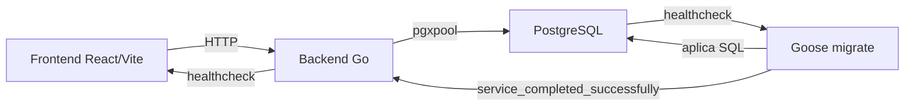
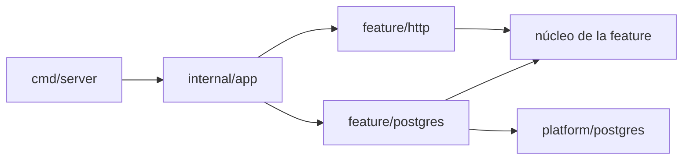

# Arquitectura y estructura

## Objetivo

LoteosAPP sigue una arquitectura modular por funcionalidad. Se aplican los
principios útiles de Clean Architecture —límites claros, dependencias hacia el
negocio y adaptadores reemplazables— sin crear capas o abstracciones que todavía
no aporten valor.

Las prioridades son:

- claridad del código;
- facilidad para localizar y modificar una funcionalidad;
- reglas del negocio independientes de HTTP, PostgreSQL y React;
- dependencias explícitas y simples de probar;
- crecimiento incremental, sin infraestructura anticipada.

## Vista general



## Backend

### Estructura objetivo

```text
apps/backend/
├── cmd/
│   ├── server/
│   │   └── main.go
│   └── migrate/
│       └── main.go
├── internal/
│   ├── app/
│   │   └── app.go
│   ├── platform/
│   │   ├── config/
│   │   ├── postgres/
│   │   ├── httpserver/
│   │   └── httpx/
│   ├── system/
│   │   ├── service.go
│   │   ├── http/
│   │   │   └── handler.go
│   │   └── postgres/
│   │       └── repository.go
│   └── lots/                    # Ejemplo de funcionalidad futura
│       ├── lot.go
│       ├── errors.go
│       ├── repository.go
│       ├── service.go
│       ├── http/
│       │   ├── handler.go
│       │   └── dto.go
│       └── postgres/
│           └── repository.go
├── Dockerfile.dev
├── go.mod
└── go.sum
```

Esta estructura se adoptará incrementalmente. No es necesario crear directorios
vacíos antes de que exista una funcionalidad que los necesite.

### Responsabilidades

- `cmd/server`: inicia el proceso, recibe señales y delega la construcción de la
  aplicación. Debe contener muy poca lógica.
- `cmd/migrate`: ejecuta las migraciones y termina.
- `internal/app`: composition root. Construye configuración, pool, repositorios,
  servicios, handlers y rutas.
- `internal/platform`: infraestructura compartida sin reglas del negocio, como
  configuración, servidor HTTP, conexión a PostgreSQL y respuestas JSON.
- `internal/<feature>`: entidades, reglas, errores, casos de uso e interfaces de
  una funcionalidad.
- `internal/<feature>/http`: adapta requests HTTP a llamadas del caso de uso y
  convierte el resultado en una respuesta.
- `internal/<feature>/postgres`: implementa los contratos de persistencia con
  `pgxpool` y SQL explícito.

### Dirección de dependencias



El núcleo de una funcionalidad no importa sus adaptadores. Por lo tanto:

- un handler no ejecuta SQL ni contiene reglas del negocio;
- un repositorio no toma decisiones del negocio;
- un servicio no conoce `http.Request`, JSON ni tipos concretos de `pgx`;
- las interfaces se definen cerca de quien las consume y se mantienen pequeñas;
- no se crea una interfaz para cada tipo, solamente para un límite real;
- las operaciones de I/O reciben `context.Context` como primer parámetro.

### Convenciones HTTP

- Los endpoints funcionales se publican bajo `/api/v1`.
- Los health checks no se versionan, por ejemplo `/healthz` y `/readyz`.
- Los handlers validan entrada, llaman al caso de uso y mapean la salida.
- Los errores deben tener un formato consistente y no exponer detalles internos:

```json
{
  "code": "lot_not_found",
  "message": "El lote solicitado no existe"
}
```

### Persistencia y pruebas

- Se usa `pgx/v5/pgxpool` con SQL explícito; no se incorpora un ORM sin una
  necesidad concreta.
- Las transacciones se controlan desde el caso de uso cuando una operación de
  negocio requiera atomicidad.
- Los servicios se prueban con implementaciones fake de sus contratos.
- Los handlers se prueban con `httptest`.
- Los repositorios PostgreSQL se prueban como integración contra una base real.

## Frontend

### Estructura objetivo

```text
apps/frontend/src/
├── app/
│   ├── App.tsx
│   ├── router.tsx              # Cuando existan varias rutas
│   └── providers.tsx           # Cuando existan providers globales
├── features/
│   ├── system-status/
│   │   ├── api/
│   │   │   └── get-system-info.ts
│   │   ├── components/
│   │   │   └── DatabaseStatus.tsx
│   │   ├── hooks/
│   │   │   └── use-system-info.ts
│   │   └── types.ts
│   └── lots/                   # Ejemplo de funcionalidad futura
│       ├── api/
│       ├── components/
│       ├── pages/
│       ├── hooks/
│       └── types.ts
├── shared/
│   ├── api/
│   │   └── client.ts
│   ├── config/
│   │   └── env.ts
│   ├── ui/
│   └── lib/
├── index.css
└── main.tsx
```

También se crea cada directorio solamente cuando tenga contenido real.

### Dirección de dependencias

```text
app → features → shared
```

- `app` configura y compone la aplicación, las rutas, layouts y providers.
- `features` contiene la UI, acceso a datos y comportamiento de cada
  funcionalidad.
- `shared/api` contiene el cliente HTTP y el tratamiento común de errores.
- `shared/config` centraliza la lectura de variables de entorno.
- `shared/ui` contiene componentes visuales sin reglas de una funcionalidad.
- `shared/lib` contiene funciones reutilizables con un propósito específico; no
  debe convertirse en un directorio genérico de helpers.
- Una feature no importa archivos internos de otra. La composición entre
  funcionalidades ocurre en `app` o en una página.
- Se prefieren imports directos y no se crean archivos `index.ts` globales que
  reexporten gran parte de la aplicación.

### Componentes y estado

- Los componentes y hooks deben ser puros; los efectos sincronizan únicamente
  con sistemas externos.
- El estado visual permanece cerca del componente que lo utiliza.
- Los datos del servidor se mantienen separados del estado visual.
- Context se reserva para información transversal estable, como autenticación o
  tema, y no para cada respuesta de la API.
- Se mantiene `fetch` mientras las necesidades sean simples. Una librería como
  TanStack Query se evaluará cuando haya caché, invalidación, mutaciones o datos
  compartidos entre varias pantallas.
- No se agrega una store global hasta que exista un flujo transversal que la
  justifique.
- Un hook se extrae cuando encapsula comportamiento reutilizable o facilita una
  prueba, no solamente para reducir el tamaño de un archivo.
- Se favorece la composición de componentes y variantes explícitas frente a
  componentes configurados con numerosos booleanos.
- Los tests se colocan junto al código probado con nombres como
  `DatabaseStatus.test.tsx`.

## Reglas comunes

- Usar el mismo vocabulario para una entidad en base de datos, backend,
  endpoints y frontend.
- No compartir directamente modelos de persistencia con respuestas HTTP.
- No crear carpetas globales `controllers`, `services`, `repositories`,
  `models`, `utils`, `helpers` o `common`.
- No introducir CQRS, event buses, microservicios o abstracciones genéricas sin
  un problema concreto que resolver.
- Cada cambio funcional debe incluir las pruebas y documentación afectadas.
- Una dependencia nueva debe justificar qué problema resuelve.

## Flujo de arranque local

`compose.yaml` define cuatro servicios:

- `db`: PostgreSQL con volumen persistente y health check `pg_isready`.
- `migrate`: aplica las migraciones pendientes y termina correctamente.
- `backend`: inicia la API después de la base y las migraciones.
- `frontend`: inicia Vite después de que el backend esté saludable.

Las migraciones son un proceso separado. Nunca se ejecutan como efecto
secundario de iniciar cada réplica del backend.

## Decisiones vigentes

- Monorepo con pnpm como único package manager de JavaScript.
- React, TypeScript, Vite y Tailwind CSS para el frontend.
- shadcn/ui como base de componentes visuales, instalados en `shared/ui`.
  Configuración manual (sin la CLI) porque el registro de shadcn no es
  accesible desde el entorno de desarrollo asistido; se agregan componentes
  copiando su código fuente cuando haga falta.
- Go para el backend.
- PostgreSQL con `pgxpool` para persistencia.
- Goose y archivos SQL versionados para migraciones.
- Arquitectura modular por funcionalidad en ambas aplicaciones.
