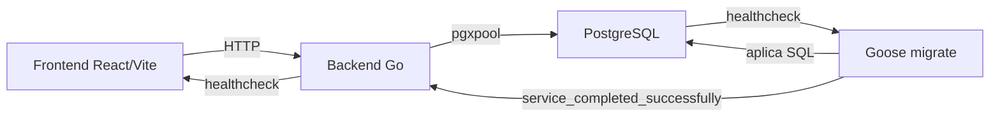
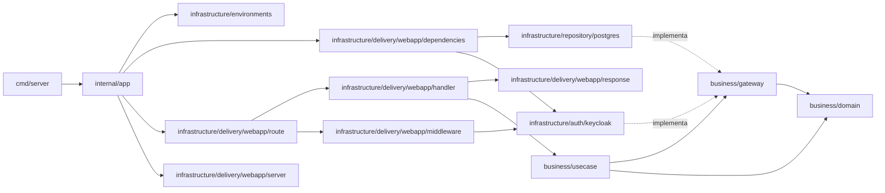

# Arquitectura y estructura

## Objetivo

LoteosAPP sigue una arquitectura modular por funcionalidad. Se aplican los
principios útiles de Clean Architecture —límites claros, dependencias hacia el
negocio y adaptadores reemplazables— sin crear capas o abstracciones que todavía
no aporten valor.

Las prioridades son:

- claridad del código;
- facilidad para localizar y modificar una funcionalidad;
- reglas del negocio independientes de HTTP, PostgreSQL y React;
- dependencias explícitas y simples de probar;
- crecimiento incremental, sin infraestructura anticipada.

## Vista general



## Backend

### Estructura objetivo

```text
apps/backend/
├── cmd/
│   ├── server/
│   │   └── main.go
│   └── migrate/
│       └── main.go
├── internal/
│   ├── app/
│   │   └── app.go
│   ├── business/
│   │   ├── domain/
│   │   │   └── system.go
│   │   ├── gateway/
│   │   │   └── repository.go
│   │   └── usecase/
│   │       └── service.go
│   └── infrastructure/
│       ├── environments/
│       │   └── config.go
│       ├── auth/
│       │   └── keycloak/
│       │       └── verifier.go
│       ├── repository/
│       │   └── postgres/
│       │       ├── pool.go
│       │       └── repository.go
│       └── delivery/
│           └── webapp/
│               ├── dependencies/
│               │   └── dependencies.go
│               ├── handler/
│               │   └── handler.go
│               ├── middleware/
│               │   └── auth.go
│               ├── response/
│               │   └── json.go
│               ├── route/
│               │   └── route.go
│               └── server/
│                   ├── server.go
│                   └── cors.go
├── Dockerfile.dev
├── go.mod
└── go.sum
```

Esta estructura se adoptará incrementalmente. No es necesario crear directorios
vacíos antes de que exista una funcionalidad que los necesite.

### Responsabilidades

- `cmd/server`: inicia el proceso, recibe señales y delega la construcción de la
  aplicación. Debe contener muy poca lógica.
- `cmd/migrate`: ejecuta las migraciones y termina.
- `internal/app`: composition root y ciclo de vida del proceso. Al iniciar, lee
  la configuración (`environments`), pide a `dependencies` el grafo de
  objetos ya armado, registra las rutas y construye el `*http.Server`. Además
  sirve requests y apaga todo de forma ordenada ante una señal de cierre.
- `internal/infrastructure/delivery/webapp/dependencies`: contenedor de
  inyección de dependencias (IoC). Recibe lo que necesita desde `internal/app`
  (por ejemplo la cadena de conexión) y arma el grafo repositorio → servicio →
  handler, listo para usar. No conoce configuración, rutas ni el servidor
  HTTP; eso es responsabilidad de `internal/app`.
- `internal/business/domain`: entidades y tipos de valor del negocio, sin
  depender de HTTP ni de PostgreSQL.
- `internal/business/gateway`: contratos (interfaces) que el negocio necesita de
  sus adaptadores, como `Repository`. Los casos de uso dependen de estos
  contratos, nunca de una implementación concreta.
- `internal/business/usecase`: casos de uso que orquestan el dominio a través de
  los contratos de `gateway`.
- `internal/infrastructure/environments`: carga de configuración desde
  variables de entorno.
- `internal/infrastructure/auth/keycloak`: valida el JWT (Bearer token)
  emitido por Keycloak contra su JWKS y extrae el `sub` y los roles del
  token. También implementa `gateway.IdentityProvider` contra la Admin REST
  API de Keycloak (alta/baja de usuarios, asignación de rol de realm),
  autenticándose con las credenciales de servicio del client del backend.
- `internal/infrastructure/auth/supabase`: adaptador equivalente para
  Supabase Auth, construido durante la migración documentada en la épica
  #100. Valida el JWT contra el JWKS del proyecto y expone el rol de dominio
  leído de `app_metadata.role`. Implementa `gateway.IdentityProvider` contra
  la Admin REST API de Supabase, autenticándose con la `service_role` key.
  Todavía no está conectado a `dependencies` ni a `middleware`; coexiste sin
  cablear hasta el corte que reemplace a `keycloak`.
- `internal/infrastructure/delivery/webapp/middleware`: adapta la
  validación de `auth/keycloak` a un middleware HTTP; rechaza requests sin
  token válido y expone el llamador autenticado al resto de la request.
- `internal/infrastructure/repository/postgres`: implementa los contratos de
  persistencia (`gateway.Repository`) con `pgxpool` y SQL explícito, y expone
  la apertura y configuración del pool de conexiones.
- `internal/infrastructure/delivery/webapp/handler`: adapta requests HTTP a
  llamadas del caso de uso y convierte el resultado en una respuesta.
- `internal/infrastructure/delivery/webapp/response`: construye respuestas JSON
  consistentes, de éxito y de error.
- `internal/infrastructure/delivery/webapp/route`: registra los endpoints HTTP
  sobre un `*http.ServeMux` a partir de los handlers.
- `internal/infrastructure/delivery/webapp/server`: construye el `*http.Server`
  y el middleware CORS.

### Dirección de dependencias



El dominio y los casos de uso no importan sus adaptadores; son los adaptadores
los que importan e implementan los contratos del negocio. Por lo tanto:

- un handler no ejecuta SQL ni contiene reglas del negocio;
- un repositorio no toma decisiones del negocio;
- un caso de uso no conoce `http.Request`, JSON ni tipos concretos de `pgx`;
- las interfaces se definen cerca de quien las consume y se mantienen pequeñas;
- no se crea una interfaz para cada tipo, solamente para un límite real;
- las operaciones de I/O reciben `context.Context` como primer parámetro.

### Convenciones HTTP

- Los endpoints funcionales se publican bajo `/api/v1`.
- Los health checks no se versionan, por ejemplo `/healthz` y `/readyz`.
- Los handlers validan entrada, llaman al caso de uso y mapean la salida.
- Los errores deben tener un formato consistente y no exponer detalles internos:

```json
{
  "code": "lot_not_found",
  "message": "El lote solicitado no existe"
}
```

### Persistencia y pruebas

- Se usa `pgx/v5/pgxpool` con SQL explícito; no se incorpora un ORM sin una
  necesidad concreta.
- Las transacciones se controlan desde el caso de uso cuando una operación de
  negocio requiera atomicidad.
- Los servicios se prueban con implementaciones fake de sus contratos.
- Los handlers se prueban con `httptest`.
- Los repositorios PostgreSQL se prueban como integración contra una base real.

## Frontend

### Estructura objetivo

```text
apps/frontend/src/
├── app/
│   ├── router.tsx
│   ├── AppLayout.tsx           # Sidebar + header + área de contenido
│   ├── Sidebar.tsx             # Navegación lateral con íconos por sección
│   ├── UserMenu.tsx            # Menú de cuenta en el header, conectado a Supabase
│   └── providers.tsx           # Cuando existan providers globales
├── features/
│   ├── auth/
│   │   ├── components/
│   │   │   ├── AppAuthProvider.tsx
│   │   │   ├── AuthStatus.tsx
│   │   │   └── RequireAuth.tsx # Guarda las rutas protegidas del router
│   │   ├── config/
│   │   │   └── supabase-client.ts
│   │   ├── hooks/
│   │   │   └── use-auth.ts     # AuthContext con sesión, login y logout
│   │   ├── lib/
│   │   │   ├── describeAuthError.ts  # Traduce el error de Supabase al usuario
│   │   │   └── resolveDisplayName.ts
│   │   └── pages/
│   │       └── LoginPage.tsx   # Formulario de email y contraseña, en /login
│   ├── system-status/
│   │   ├── api/
│   │   │   └── get-system-info.ts
│   │   ├── components/
│   │   │   └── DatabaseStatus.tsx
│   │   ├── hooks/
│   │   │   └── use-system-info.ts
│   │   ├── pages/
│   │   │   └── MonitorPage.tsx # Diagnóstico del entorno, en /monitor
│   │   └── types.ts
│   └── lots/                   # Ejemplo de funcionalidad futura
│       ├── api/
│       ├── components/
│       ├── pages/
│       ├── hooks/
│       └── types.ts
├── shared/
│   ├── api/
│   │   └── client.ts
│   ├── config/
│   │   └── env.ts
│   ├── ui/
│   └── lib/
├── index.css
└── main.tsx
```

También se crea cada directorio solamente cuando tenga contenido real.

### Dirección de dependencias

```text
app → features → shared
```

- `app` configura y compone la aplicación, las rutas, layouts y providers.
- `features` contiene la UI, acceso a datos y comportamiento de cada
  funcionalidad.
- `shared/api` contiene el cliente HTTP y el tratamiento común de errores.
- `shared/config` centraliza la lectura de variables de entorno.
- `shared/ui` contiene componentes visuales sin reglas de una funcionalidad.
- `shared/lib` contiene funciones reutilizables con un propósito específico; no
  debe convertirse en un directorio genérico de helpers.
- Una feature no importa archivos internos de otra. La composición entre
  funcionalidades ocurre en `app` o en una página.
- Se prefieren imports directos y no se crean archivos `index.ts` globales que
  reexporten gran parte de la aplicación.

### Componentes y estado

- Los componentes y hooks deben ser puros; los efectos sincronizan únicamente
  con sistemas externos.
- El estado visual permanece cerca del componente que lo utiliza.
- Los datos del servidor se mantienen separados del estado visual.
- Context se reserva para información transversal estable, como autenticación o
  tema, y no para cada respuesta de la API.
- Se mantiene `fetch` mientras las necesidades sean simples. Una librería como
  TanStack Query se evaluará cuando haya caché, invalidación, mutaciones o datos
  compartidos entre varias pantallas.
- No se agrega una store global hasta que exista un flujo transversal que la
  justifique.
- Un hook se extrae cuando encapsula comportamiento reutilizable o facilita una
  prueba, no solamente para reducir el tamaño de un archivo.
- Se favorece la composición de componentes y variantes explícitas frente a
  componentes configurados con numerosos booleanos.
- Los tests se colocan junto al código probado con nombres como
  `DatabaseStatus.test.tsx`.

### Diseño responsive

- La app tiene que poder usarse desde el celular, así que los componentes
  nuevos se diseñan mobile-first.
- Con Tailwind esto significa escribir primero las clases sin prefijo
  (aplican a cualquier tamaño) pensando en la pantalla más chica, y agregar
  `sm:`/`md:`/`lg:` solamente para adaptar a pantallas más grandes — nunca al
  revés.
- Antes de dar por terminado un componente nuevo, probarlo al menos en un
  viewport angosto (~375px de ancho) además del tamaño de escritorio.

## Reglas comunes

- Usar el mismo vocabulario para una entidad en base de datos, backend,
  endpoints y frontend.
- No compartir directamente modelos de persistencia con respuestas HTTP.
- No crear carpetas globales `controllers`, `services`, `repositories`,
  `models`, `utils`, `helpers` o `common`.
- No introducir CQRS, event buses, microservicios o abstracciones genéricas sin
  un problema concreto que resolver.
- Cada cambio funcional debe incluir las pruebas y documentación afectadas.
- Una dependencia nueva debe justificar qué problema resuelve.

## Flujo de arranque local

`compose.yaml` define cuatro servicios:

- `db`: PostgreSQL con volumen persistente y health check `pg_isready`.
- `migrate`: aplica las migraciones pendientes y termina correctamente.
- `backend`: inicia la API después de la base y las migraciones.
- `frontend`: inicia Vite después de que el backend esté saludable.

Las migraciones son un proceso separado. Nunca se ejecutan como efecto
secundario de iniciar cada réplica del backend.

## Decisiones vigentes

- Monorepo con pnpm como único package manager de JavaScript.
- React, TypeScript, Vite y Tailwind CSS para el frontend.
- shadcn/ui como base de componentes visuales, instalados en `shared/ui`.
  Configuración manual (sin la CLI) porque el registro de shadcn no es
  accesible desde el entorno de desarrollo asistido; se agregan componentes
  copiando su código fuente cuando haga falta.
- Go para el backend.
- PostgreSQL con `pgxpool` para persistencia.
- Goose y archivos SQL versionados para migraciones.
- Arquitectura modular por funcionalidad en ambas aplicaciones.
