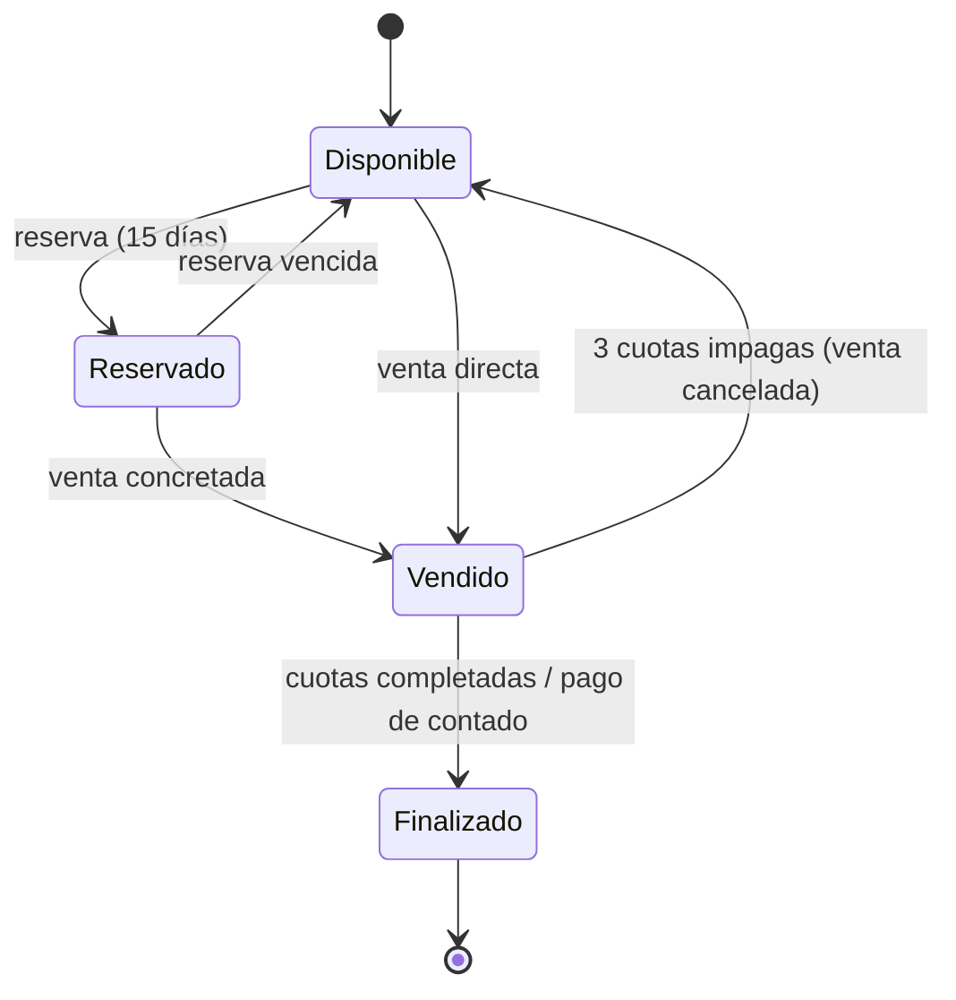

# Dominio: Sistema de Gestión de Lotes

Documentación técnica derivada del relevamiento funcional v1.0 (15/07/2026).
Describe entidades, roles, reglas de negocio y flujos que el backend y el
frontend deben implementar. Ver [architecture.md](architecture.md) para cómo
se organiza el código de cada funcionalidad.

## Estado del lote

Todo lote nace `disponible` y conserva un único estado vigente junto con un
historial inmutable. Las transiciones admitidas son:

- `disponible -> reservado` al crear una reserva;
- `disponible -> vendido` para una venta directa;
- `reservado -> disponible` al vencer o cancelar la reserva;
- `reservado -> vendido` al convertir la reserva en venta;
- `vendido -> disponible` al cancelar la venta;
- `vendido -> finalizado` al completar el pago.

`finalizado` es terminal. Cada evento conserva el origen (`alta`, `reserva`,
`venta`, `cobranza`, `sistema` o `correccion`), el actor cuando existe, la
fecha, una razón cuando corresponde y las referencias a reserva o venta. Una
cancelación manual originada en una reserva o venta exige una justificación.
El estado vigente solo cambia al agregar un evento al historial.

## Entidades principales

- **Loteo**: nombre, ubicación (ciudad), descripción, inmobiliarias
  asociadas (una o más), archivo DXF de origen; límite general como
  polígono (capa `LOTEO` del DXF).
- **Manzana**: pertenece a un loteo; polígono (capa `MANZANA` del DXF);
  hasta 4 calles asociadas.
- **Lote**: pertenece a una manzana; polígono (capa `LOTES` del DXF); número
  asignado manualmente en el sistema, precio, superficie, características,
  estado.
- **Calle**: pertenece a un loteo; polígono (capa `CALLE` del DXF); nombre
  y tipo (`asfalto`, `tierra`, `brosa`, `granito`) asignados manualmente.
- **Cliente**: nombre y apellido, DNI, celular, mail. No tiene acceso al
  sistema. Puede tener múltiples lotes en distintos estados (en compra, en
  financiación, finalizados).
- **Reserva**: vincula un cliente a un lote individual por 15 días, sin costo
  ni pago.
- **Venta**: vincula lote, cliente, vendedor y modalidad de pago (contado,
  financiado, entrega + financiación).
- **Cuota**: pago periódico de una venta financiada; puede incluir
  impuesto municipal, impuesto provincial, cargo de inmobiliaria y otros.
- **Usuario**: cuenta interna con rol y loteos asignados. Creado por el
  administrador (excepto el propio administrador).
- **Inmobiliaria**: agencia externa (nombre, contacto) asociada a uno o más
  loteos. Es una entidad propia, distinta del rol de usuario
  **Inmobiliaria** (ver [Usuarios y roles](#usuarios-y-roles)). Un usuario
  con ese rol apunta a la agencia (`usuarios.inmobiliaria_id`). En reserva
  y venta la agencia se obtiene del vendedor, no se guarda aparte.

## Alta y visualización de un loteo

1. Formulario inicial: nombre, ubicación/ciudad, inmobiliarias (una o
   varias) y descripción breve.
2. Carga opcional del archivo DXF (ver [Estructura del DXF](#estructura-requerida-del-archivo-dxf)).
3. Carga opcional de fotos, planos u otra información complementaria.
4. El DXF se parsea en el frontend al momento de la carga: se extraen los
   polígonos de loteo, manzanas, lotes y calles (capas `LOTEO`, `MANZANA`,
   `LOTES` y `CALLE`) y se envían al backend junto con el archivo original.
   El backend no parsea el DXF; solo valida y persiste la geometría recibida.
5. Las capas son solo geometría, sin texto: el número de cada lote y el
   nombre de cada calle no se extraen del DXF; se cargan manualmente tras
   visualizar el plano.
6. Visualización con navegación por capas: loteo → manzana, lote o calle.
7. Carga de datos por lote (clic sobre el lote): precio, superficie
   (si no hay un valor guardado, se precarga con Gauss sobre la poligonal
   cerrada del plano, en m², y se puede corregir a mano), características.
8. Carga de datos por manzana (clic sobre la manzana): número, servicios
   (agua, cloaca, luz, gas) y hasta 4 calles del loteo que la rodean.
9. Carga de datos por calle (clic sobre la calle): nombre y tipo de
   superficie (`asfalto`, `tierra`, `brosa`, `granito`).
10. Documentación legal del loteo (escrituras, certificaciones, poderes,
   cartas documento) se carga y consulta desde esta misma vista, a cargo del
   escribano asignado. No existe una sección de menú separada para esto; el
   detalle de esta funcionalidad queda para una futura iteración.

## Inmobiliarias

Alta y gestión de inmobiliarias (agencias externas) asociadas a los loteos,
desde el módulo **Inmobiliarias**. Una inmobiliaria tiene razón social
(obligatoria), CUIT, teléfono y email.

- Alta, modificación y baja: solo administrador.
- Listado y búsqueda por razón social o CUIT: administrador y administrativo.
- La baja es lógica: la agencia deja de aparecer en el catálogo, pero se
  conserva la fila y con ella el historial de los loteos y usuarios que la
  nombran.
- Dos inmobiliarias activas no pueden compartir CUIT. El CUIT se guarda como
  11 dígitos, sin separadores, así que da igual cómo se tipee.
- Las inmobiliarias no acceden al sistema como tales: quien opera es un
  usuario con rol inmobiliaria.

En el [alta de un loteo](#alta-y-visualización-de-un-loteo) se eligen una o
más agencias de ese catálogo; el filtro por nombre es en el cliente porque el
listado es chico y el API las devuelve todas. Hasta que exista la asociación
loteo–inmobiliaria, el control permanece visible pero deshabilitado para no
simular una asociación que todavía no puede persistirse.

Los usuarios con rol inmobiliaria pertenecen a una agencia; esa es la
inmobiliaria de una [reserva](#reservas) o [venta](#venta) a través del
vendedor. La agencia se elige al dar de alta el usuario
(`usuarios.inmobiliaria_id`): es obligatoria para rol inmobiliaria y no se
guarda para ningún otro rol; el alta rechaza una agencia inexistente o dada
de baja. No se reasigna después del alta.

## Usuarios y roles

Todos los usuarios, salvo el administrador, son creados por el administrador,
quien asigna loteos y permisos.

| Rol | Puede | No puede |
|---|---|---|
| **Administrador** | Control total: crea usuarios, asigna permisos y loteos, gestiona ventas, cobranzas, edición/eliminación de lotes | — |
| **Administrativo** | Visualizar información, editar ciertos datos (configurable, ver [Roles y permisos](#gestión-de-roles-y-permisos)), cargar ventas | Crear usuarios, asignar permisos, vender por sí mismo sin definición del admin, editar/eliminar lotes |
| **Agrimensor** | Cargar DXF; cargar fotos y planos del loteo o de un lote (no de una manzana); editar información de manzanas/lotes/calles en loteos asignados | Operar loteos no asignados |
| **Escribano** | Administrar documentación legal (escrituras, certificaciones, poderes, cartas documento) en loteos asignados | Editar información de loteos, manzanas, lotes o calles |
| **Inmobiliaria** | Ver loteos asignados (completo, manzanas, lotes y calles), consultar disponibilidad/precio/estado, gestionar clientes (alta/modificación), reservar y vender lotes individuales en loteos asignados, cobrar sobre el loteo asignado | Reservar manzanas o loteos completos, operar loteos no asignados |

Los clientes no son usuarios del sistema.

### ABM de administrativo, escribano, inmobiliaria y agrimensor

El administrador da de alta, edita (nombre y apellido), da de baja y
reactiva usuarios con rol administrativo, escribano, inmobiliaria o
agrimensor desde el módulo **Usuarios**. El email identifica la cuenta en
el proveedor de identidad y no se edita desde acá; el rol se fija en el
alta y no cambia después. La baja es lógica (`usuarios.fecha_baja`): el
usuario deja de poder operar pero su fila se conserva para no romper las FK
de auditoría (`usuario_modificacion`, `usuario_loteos`, reservas, ventas).
Reactivar limpia `fecha_baja` y deja al usuario operar de nuevo; no
restaura ningún otro estado (por ejemplo, no reasigna loteos que se le
hayan quitado mientras estaba de baja). El administrador no se gestiona
desde ningún ABM.

Agrimensor iba a tener un ABM propio (`features/surveyors`,
`/api/v1/agrimensores`, PR #164), pero se deprecó antes de mergear: un
agrimensor es un usuario con `rol = 'agrimensor'` como cualquier otro, sin
necesidad de un módulo aparte, así que quedó unificado en esta misma
pantalla.

Al dar de alta un usuario, además de devolver la contraseña temporal en la
respuesta, se le manda un mail de invitación (nombre, rol, la contraseña
temporal y el link de login) por si el administrador no llega a comunicársela
a mano. Si el envío falla no bloquea el alta — el admin ya tiene la
contraseña igual — y se puede reenviar bajo demanda
(`POST /api/v1/usuarios/{id}/reenviar-invitacion`); el reenvío pide una
contraseña temporal nueva (la original nunca se guarda en ningún lado, solo
vive en memoria durante un intento de envío).

Cualquier usuario (no solo los recién creados) puede recuperar su contraseña
sin estar logueado, desde "¿Olvidaste tu contraseña?" en el login:
`POST /api/v1/auth/recuperar-contrasena` con el email, y si corresponde a una
cuenta activa, se manda un mail con un link de un solo uso que vence al cabo
de una hora (`PasswordResetTokenTTL`) — nunca una contraseña por mail. La
respuesta es siempre la misma (204), exista o no el email, para no revelar
qué correos están registrados. El link lleva a un formulario donde se elige
la contraseña nueva, que confirma `POST /api/v1/auth/restablecer-contrasena`
con el token y la contraseña; recién ahí cambia la contraseña real en
Supabase, nunca al pedir el link — así, alguien que solo conoce el mail de
otro usuario puede, como mucho, hacer que le lleguen mails de recupero, pero
no puede invalidarle la contraseña actual sin acceso a esa casilla. El token
vive en memoria del proceso (sin tabla ni migración), es de un solo uso, y se
invalida al primer intento de canje aunque falle.

La baja bloquea el acceso de inmediato, no solo la visibilidad en el
listado: `middleware.RequireActiveAccount` corre en cada request autenticado
(detrás de `RequireAuth`, en toda la API, no solo en `/usuarios`) y rechaza
con 403 a cualquier caller cuya fila en `usuarios` tenga `fecha_baja`
seteado. Esto es necesario porque la verificación del token de Supabase es
stateless (contra el JWKS publicado, sin ida y vuelta a Supabase por
request): un token ya emitido seguiría siendo válido hasta su expiración
aunque la cuenta se deshabilitara del lado de Supabase, así que la única
fuente de verdad sobre si un usuario puede operar es `usuarios.fecha_baja`.
La cuenta en el proveedor de identidad no se toca al dar de baja ni al
reactivar.

### Gestión de roles y permisos

Módulo de configuración exclusivo del administrador para definir, por usuario:

- qué puede hacer/editar el administrativo;
- qué loteos puede ver y operar cada agrimensor;
- qué loteos puede ver, reservar y cobrar cada inmobiliaria;
- qué loteos puede documentar cada escribano.

## Clientes

- Alta y modificación: administrador, administrativo e inmobiliaria.
- Baja: solo administrador.
- Listado y búsqueda: administrador, administrativo e inmobiliaria. Agrimensor
  y escribano no acceden al directorio de clientes.
- Sin acceso al sistema.

## Reservas

- Solo lotes individuales (no manzanas ni loteos completos).
- Quién reserva: usuario activo con rol `administrador`, `administrativo` o
  `inmobiliaria` (`usuario_alta`). La inmobiliaria solo puede reservar en un
  loteo asignado a su agencia y siempre queda como vendedor responsable.
- Vendedor: usuario responsable comercial (`vendedor_id`); si tiene rol
  `inmobiliaria`, debe pertenecer a una agencia activa asignada al loteo.
  Administrador y administrativo lo eligen desde el catálogo de vendedores
  elegibles; no se amplía por eso su acceso al ABM de usuarios.
- Inmobiliaria interviniente: se persiste en `reservas.inmobiliaria_id` para
  conservar el alcance histórico, incluyendo las reservas creadas por un
  administrativo a nombre de un vendedor de inmobiliaria. La inmobiliaria
  ve todas las reservas de esa agencia aunque luego cambie la asignación del
  loteo; un administrativo ve todas las reservas. Registros anteriores se
  completan desde la agencia del vendedor cuando es posible y el resto queda
  con `NULL`.
- Estado vigente en `reservas.estado_actual`; las transiciones se registran
  solo en `reserva_estados`. Solo una reserva `activa` por lote. Los estados
  `cancelada`, `vencida` y `convertida` son terminales para este circuito.
- Duración: exactamente 360 horas desde el instante autoritativo del servidor,
  sin costo, prórroga ni edición manual. Se persiste como `TIMESTAMPTZ` y se
  muestra en `America/Argentina/Buenos_Aires`.
- Crear reserva mueve el lote de `disponible` a `reservado`. Cancelar antes
  del vencimiento, o vencerla, mueve el lote de `reservado` a `disponible` en
  la misma transacción.
- Cancelar exige una justificación y solo lo puede hacer un usuario
  administrativo, un administrador o un usuario de la inmobiliaria persistida
  en la reserva. `puedeCancelar` se calcula en el servidor y la API vuelve a
  validar el permiso al cancelar. Una repetición sobre una reserva ya
  cancelada devuelve el resultado existente sin agregar otro evento.
- La creación acepta una clave de idempotencia por actor: repetir la misma
  clave y payload devuelve la misma reserva; reutilizarla con otro payload es
  un conflicto.
- El historial conserva sus referencias aunque usuarios o clientes sean
  dados de baja. Las bajas impiden nuevas operaciones, pero no eliminan la
  auditoría.
- Un worker del backend regulariza reservas vencidas al iniciar y luego cada
  minuto por defecto; un retraso del worker no extiende el plazo comercial.
- El comprobante PDF descargable muestra el loteo y el lote, cliente, vendedor,
  inmobiliaria, fechas y fecha de emisión. Incluye un croquis de referencia sin
  escala con el lote reservado resaltado; los demás lotes se muestran sin
  estado ni numeración. Si el lote no tiene geometría cargada, el comprobante
  lo informa en lugar del croquis. También aclara que es un comprobante, no
  implica una venta, puede cancelarlo el cliente o la inmobiliaria y se cancela
  automáticamente si no se concreta la venta en 15 días.

## Venta

Cargada por administrador, administrativo o un usuario de inmobiliaria cuya
agencia está asignada al loteo (`usuario_alta`):

- lote vendido, cliente comprador;
- la venta se inicia desde el visualizador del loteo, con el lote ya
  elegido —solo un lote `disponible` con número y precio—, igual que la
  reserva;
- vendedor responsable (`vendedor_id`); si tiene rol inmobiliaria, la
  agencia se lee de `usuarios.inmobiliaria_id`. Administrador y administrativo
  eligen primero la inmobiliaria —cualquiera activa con al menos un vendedor
  cargado, o «Venta directa» para vender como internos— y después uno de sus
  vendedores; a diferencia de la reserva, para ellos la agencia no tiene que
  estar asignada al loteo. Un usuario con rol inmobiliaria solo puede cargar
  la venta si su agencia está asignada al loteo, y elige el vendedor entre
  los de su propia agencia, así que puede cargar la venta de un colega. Es
  la diferencia con la reserva, donde la inmobiliaria siempre queda como
  vendedor responsable. Por defecto el
  vendedor es quien carga la venta: un administrador o administrativo, que no
  pertenece a ninguna agencia, queda como vendedor de una venta directa sin
  tener que elegir nada;
- estado vigente en `ventas.estado_actual`; las transiciones se registran
  solo en `venta_estados`. Una venta no cancelada por lote; al confirmar,
  el lote pasa a `vendido` en la misma transacción y el monto y la moneda
  quedan copiados del precio del lote en ese momento. Una venta al contado
  se cobra al registrarse: en esa misma transacción pasa a `completada`
  (razón «Pago al contado») y el lote de `vendido` a `finalizado`, con
  origen `venta`; las financiadas quedan `activa` hasta que Cobranza cobre
  la última cuota;
- modalidad de pago: contado, financiado (cuotas y % interés configurable),
  o entrega + financiación (una entrega inicial y el resto en cuotas). Las
  dos modalidades financiadas llevan un plan de pago que se registra junto
  con la venta (ver «Plan de pago»);
- el alta acepta una clave de idempotencia por actor, como la reserva:
  repetir la misma clave y payload (incluido el plan de pago) devuelve la
  misma venta; reutilizarla con otro payload es un conflicto;
- listado y detalle desde el módulo **Ventas**, con el mismo alcance que
  las reservas: administrador y administrativo ven todas; un usuario de
  inmobiliaria, las vendidas por su agencia. Se busca por cliente, loteo,
  lote o vendedor y se filtra por estado; el detalle vuelve a imprimir el
  recibo.

Vender un lote `reservado` solo lo puede hacer el vendedor responsable de esa
reserva (`reservas.vendedor_id`): la reserva le pertenece a quien la tomó, y
la venta la concreta esa misma persona. El vendedor de la venta no se elige
entonces, sale de la reserva. Un lote `disponible` no tiene esa restricción y
lo vende cualquier vendedor elegible. La conversión de una reserva en venta
todavía no está implementada: hoy solo se vende un lote `disponible`.

Al completarse, se genera un recibo con descripción de lo comprado, comprador,
vendedor e inmobiliaria y medio de pago, que se imprime desde el navegador (o
se guarda como PDF). El código QR o link de verificación de autenticidad queda
para más adelante.

### Plan de pago

Una venta financiada o con entrega + financiación crea, en la misma
transacción, un plan de pago (`planes_pago`) y sus cuotas (`cuotas`), todas
`pendiente`. Cobrarlas es tarea del módulo de Cobranza.

- `cantidadCuotas`: entero entre 1 y 360.
- `tasaInteres`: porcentaje entre 0 y 1000, con hasta 4 decimales (lo que
  guarda `planes_pago.tasa_interes`), que se aplica **una sola vez** sobre el
  monto financiado (interés simple); 0 o ausente es sin interés.
- `periodicidad`: `mensual`, `bimestral`, `trimestral` o `semestral`.
- `montoEntrega`: obligatorio, mayor a cero, con hasta 2 decimales y menor al
  precio del lote, solo en entrega + financiación. En financiado no se admite.
  La entrega no se registra como cobrada: queda en el plan para Cobranza.
- Una venta al contado no admite plan.

Fórmula (idéntica en backend y frontend, redondeando a 2 decimales):

```text
financiado = round2(precio - montoEntrega)
cuota      = round2(round2(financiado * (1 + tasaInteres / 100)) / cantidadCuotas)
total      = round2(cuota * cantidadCuotas)
```

Todas las cuotas valen lo mismo; el total financiado es lo que suman las
cuotas y puede diferir del interés exacto en unos centavos (4.600 en 12
cuotas son 12 de 383,33 = 4.599,96). Si la cuota queda por debajo de un
centavo, la venta se rechaza.

Vencimientos: la cuota `k` vence `k` períodos después de la fecha de la
venta, el mismo día del mes; si el mes destino es más corto, vence el último
día (una venta del 31 de enero con cuotas mensuales vence el 28/29 de
febrero, el 31 de marzo, el 30 de abril…). No se ingresa una fecha de primer
vencimiento.

## Cobranza

Gestionada por administrador, administrativo o inmobiliaria asignada al
loteo:

- registro del monto abonado por cuota, más adicionales opcionales: impuesto
  municipal, impuesto provincial, cargo de inmobiliaria, otros;
- recibo por cada pago con detalle de cuota y datos del lote;
- estado de deuda exportable en PDF (cuotas pagadas/pendientes).

No se gestionan comisiones ni reparto de dinero entre inmobiliaria y dueño del
loteo; solo interesa que el cobro quede registrado.

### Reglas de mora

- 3 cuotas impagas acumuladas → cancelación automática de la venta y el lote
  vuelve a estar disponible.
- El dinero ya abonado no se devuelve.
- Notificaciones:
  - dashboard del administrador con cuotas vencidas;
  - mail al cliente ante vencimiento próximo y riesgo de pérdida del lote;
  - aviso previo a administrador/administrativo sobre cuotas del mes en curso
    próximas a vencer.

## Ciclo de vida del lote



## Estructura requerida del archivo DXF

- Cuatro capas obligatorias, cada una solo geometría (sin texto/etiquetas):
  - `LOTEO`: límite general del loteo, como polígono cerrado único.
  - `MANZANA`: cada manzana es una polilínea cerrada independiente.
  - `LOTES`: cada lote/parcela es una polilínea cerrada independiente.
  - `CALLE`: cada calle es una polilínea cerrada independiente.
- Todos los polígonos (loteo, manzanas, lotes, calles): cerrados e
  independientes, sin interrupciones, superposiciones ni geometría abierta.
  Es un requisito del plano que entrega el agrimensor, y el backend lo verifica
  solo en parte: rechaza el anillo abierto, colineal, de área nula o que se
  cruza a sí mismo, pero **todavía no detecta superposiciones entre entidades
  de una misma capa** (ver `docs/architecture.md` § Alta de loteo y
  [#176](https://github.com/LoteoApp/LoteosAPP/issues/176)).
- Como las capas no traen texto, el número de cada lote y el nombre de cada
  calle no se pueden asociar automáticamente al polígono; se asignan
  manualmente en el sistema tras visualizar el plano.
- Capas `MEJORA`, `LM`, `REMANENTE` o `PARCELARIO`: no obligatorias.
- Solo se procesa la información de las capas `LOTEO`, `MANZANA`, `LOTES` y
  `CALLE`. El parser acepta también las variantes en singular/plural
  `MANZANAS`, `LOTE` y `CALLES`, ya que distintos agrimensores nombran las
  capas de forma distinta.
- El parseo del archivo ocurre en el frontend (no en el backend); el backend
  recibe la geometría ya extraída. El archivo DXF original sí se guarda: tras
  crear el loteo, el frontend lo sube por `PUT /api/v1/loteos/{id}/dxf` y el
  backend lo almacena en Cloudflare R2 con una clave versionada
  (`loteos/{id}/dxf/{version}.dxf`) y su fila en `archivos`
  (`categoria = 'dxf'`). Ver `docs/architecture.md` § Almacenamiento de
  archivos.

### Georreferenciación

- Opcional.
- Si está presente, sistema de coordenadas Gauss-Krüger, Faja 5 o Faja 6
  según la ubicación del loteo.
- Permite posicionar el loteo sobre un visor cartográfico o mapa base.
- Sin georreferenciar, el archivo igual se procesa y visualiza, pero sin
  ubicación automática sobre un mapa.
- Si está georreferenciado, debe conservar posición, escala y sistema de
  coordenadas original.

## Fuera de alcance / a definir en una futura iteración

- Especificación técnica de procesamiento del DXF (librerías, etc.).
- Detalle de comisiones de la inmobiliaria.
- Historial de cambios / trazabilidad de modificaciones (quién modificó qué
  lote o venta).
