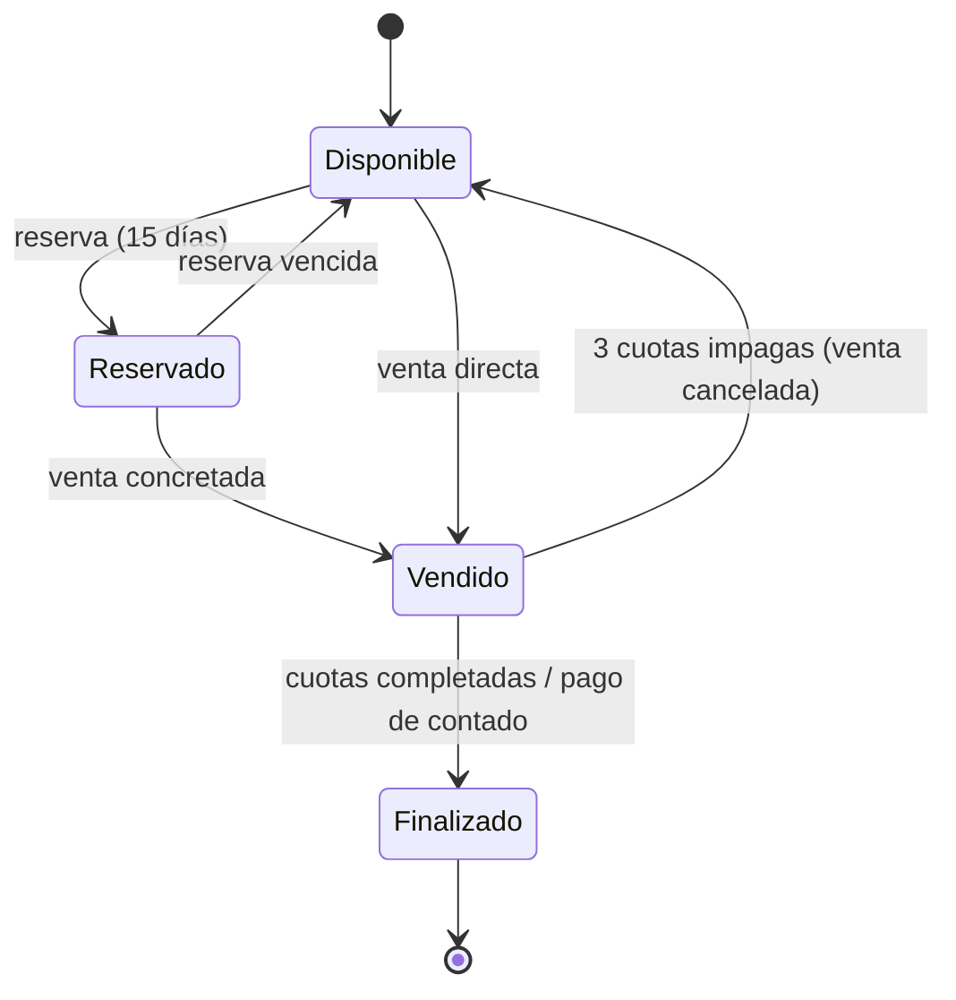

# Dominio: Sistema de Gestión de Lotes

Documentación técnica derivada del relevamiento funcional v1.0 (15/07/2026).
Describe entidades, roles, reglas de negocio y flujos que el backend y el
frontend deben implementar. Ver [architecture.md](architecture.md) para cómo
se organiza el código de cada funcionalidad.

## Entidades principales

- **Loteo**: nombre, ubicación, descripción, archivo DXF de origen.
- **Manzana**: pertenece a un loteo; hasta 4 calles asociadas.
- **Lote**: pertenece a una manzana; número (del DXF), precio, superficie,
  características, estado.
- **Cliente**: nombre y apellido, DNI, celular, mail. No tiene acceso al
  sistema. Puede tener múltiples lotes en distintos estados (en compra, en
  financiación, finalizados).
- **Reserva**: vincula un cliente a un lote individual por 15 días, sin costo
  ni pago.
- **Venta**: vincula lote, cliente, modalidad de pago (contado, financiado,
  entrega + financiación) e inmobiliaria/referente si corresponde.
- **Cuota**: pago periódico de una venta financiada; puede incluir
  impuesto municipal, impuesto provincial, cargo de inmobiliaria y otros.
- **Usuario**: cuenta interna con rol y loteos asignados. Creado por el
  administrador (excepto el propio administrador).
- **Inmobiliaria**: agencia externa (nombre, contacto) asociada a uno o más
  loteos; se referencia desde Reserva y Venta como inmobiliaria
  interviniente/referente. Es una entidad propia, distinta del rol de
  usuario **Inmobiliaria** (ver [Usuarios y roles](#usuarios-y-roles)).

## Alta y visualización de un loteo

1. Formulario inicial: nombre, ubicación, descripción breve.
2. Carga opcional del archivo DXF (ver [Estructura del DXF](#estructura-requerida-del-archivo-dxf)).
3. Carga opcional de fotos, planos u otra información complementaria.
4. Del DXF se extraen los polígonos de manzanas y lotes junto con el número de
   lote, usado para vincular información cargada después.
5. Los nombres de calles no se extraen del DXF; se cargan manualmente tras
   visualizar el plano.
6. Visualización con navegación por capas: loteo → manzana → lote.
7. Carga de datos por lote (clic sobre el lote): precio, superficie,
   características.
8. Carga de datos por manzana: hasta 4 calles que la rodean.
9. Documentación legal del loteo (escrituras, certificaciones, poderes,
   cartas documento) se carga y consulta desde esta misma vista, a cargo del
   escribano asignado. No existe una sección de menú separada para esto; el
   detalle de esta funcionalidad queda para una futura iteración.

## Inmobiliarias

Alta y gestión de inmobiliarias (agencias externas) asociadas a los loteos,
desde el módulo **Inmobiliaria**. Se usan para completar el campo
"inmobiliaria interviniente/referente" en [Reservas](#reservas) y
[Venta](#venta). Campos y permisos de alta a definir en una futura
iteración; el módulo está en construcción.

## Usuarios y roles

Todos los usuarios, salvo el administrador, son creados por el administrador,
quien asigna loteos y permisos.

| Rol | Puede | No puede |
|---|---|---|
| **Administrador** | Control total: crea usuarios, asigna permisos y loteos, gestiona ventas, cobranzas, edición/eliminación de lotes | — |
| **Administrativo** | Visualizar información, editar ciertos datos (configurable, ver [Roles y permisos](#gestión-de-roles-y-permisos)), cargar ventas | Crear usuarios, asignar permisos, vender por sí mismo sin definición del admin, editar/eliminar lotes |
| **Agrimensor** | Cargar DXF, fotos, planos e información de manzanas/lotes en loteos asignados; editar loteos/manzanas/lotes | Operar loteos no asignados |
| **Escribano** | Administrar documentación legal (escrituras, certificaciones, poderes, cartas documento) en loteos asignados | Editar información de loteos, manzanas o lotes |
| **Inmobiliaria** | Ver loteos asignados (completo, manzanas, lotes), consultar disponibilidad/precio/estado, gestionar clientes (alta/modificación), reservar lotes individuales, cobrar sobre el loteo asignado | Reservar manzanas o loteos completos, operar loteos no asignados |

Los clientes no son usuarios del sistema.

### Gestión de roles y permisos

Módulo de configuración exclusivo del administrador para definir, por usuario:

- qué puede hacer/editar el administrativo;
- qué loteos puede ver y operar cada agrimensor;
- qué loteos puede ver, reservar y cobrar cada inmobiliaria;
- qué loteos puede documentar cada escribano.

## Clientes

- Alta y modificación: administrativo e inmobiliaria.
- Baja: solo administrador.
- Sin acceso al sistema.

## Reservas

- Solo lotes individuales (no manzanas ni loteos completos).
- Quién reserva: inmobiliaria, administrativo o administrador.
- Duración: 15 días, sin costo, sin registro de pago.
- Al vencer sin concretar venta, el lote vuelve a estar disponible
  automáticamente.

## Venta

Cargada por administrador o administrativo:

- lote vendido, cliente comprador;
- inmobiliaria interviniente y referente, si corresponde;
- modalidad de pago: contado, financiado (cuotas y % interés configurable),
  o entrega + financiación.

Al completarse, se genera un recibo PDF con descripción de lo comprado, medio
de pago y código QR o link de verificación de autenticidad.

## Cobranza

Gestionada por administrador, administrativo o inmobiliaria asignada al
loteo:

- registro del monto abonado por cuota, más adicionales opcionales: impuesto
  municipal, impuesto provincial, cargo de inmobiliaria, otros;
- recibo por cada pago con detalle de cuota y datos del lote;
- estado de deuda exportable en PDF (cuotas pagadas/pendientes).

No se gestionan comisiones ni reparto de dinero entre inmobiliaria y dueño del
loteo; solo interesa que el cobro quede registrado.

### Reglas de mora

- 3 cuotas impagas acumuladas → cancelación automática de la venta y el lote
  vuelve a estar disponible.
- El dinero ya abonado no se devuelve.
- Notificaciones:
  - dashboard del administrador con cuotas vencidas;
  - mail al cliente ante vencimiento próximo y riesgo de pérdida del lote;
  - aviso previo a administrador/administrativo sobre cuotas del mes en curso
    próximas a vencer.

## Ciclo de vida del lote

## Estructura requerida del archivo DXF

- Capa obligatoria: `MENSURA`, con la totalidad del loteo (manzanas y lotes).
- Cada manzana y cada lote: polilínea cerrada e independiente, sin
  interrupciones, superposiciones ni geometría abierta.
- Múltiples polígonos: cada uno como poligonal cerrada individual.
- El identificador de cada lote debe estar asociado gráficamente a su
  polígono.
- Las calles pueden representarse como espacios entre manzanas; sus nombres
  se cargan manualmente en el sistema.
- Capas `MEJORA`, `LM`, `REMANENTE` o `PARCELARIO`: no obligatorias.
- Solo se procesa la información de la capa `MENSURA`.

### Georreferenciación

- Opcional.
- Si está presente, sistema de coordenadas Gauss-Krüger, Faja 5 o Faja 6
  según la ubicación del loteo.
- Permite posicionar el loteo sobre un visor cartográfico o mapa base.
- Sin georreferenciar, el archivo igual se procesa y visualiza, pero sin
  ubicación automática sobre un mapa.
- Si está georreferenciado, debe conservar posición, escala y sistema de
  coordenadas original.

## Fuera de alcance / a definir en una futura iteración

- Especificación técnica de procesamiento del DXF (librerías, etc.).
- Detalle de comisiones de la inmobiliaria.
- Historial de cambios / trazabilidad de modificaciones (quién modificó qué
  lote o venta).
