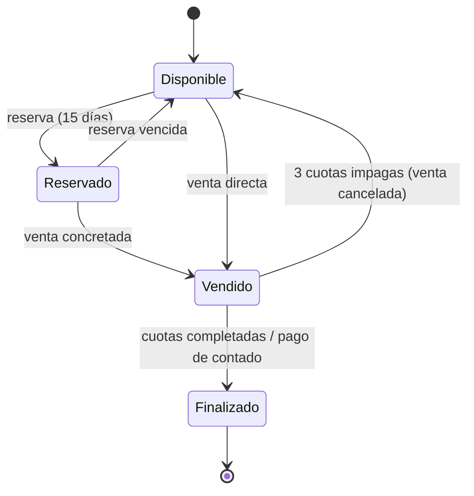

# Dominio: Sistema de Gestión de Lotes

Documentación técnica derivada del relevamiento funcional v1.0 (15/07/2026).
Describe entidades, roles, reglas de negocio y flujos que el backend y el
frontend deben implementar. Ver [architecture.md](architecture.md) para cómo
se organiza el código de cada funcionalidad.

## Entidades principales

- **Loteo**: nombre, ubicación (ciudad), descripción, inmobiliarias
  asociadas (una o más), archivo DXF de origen; límite general como
  polígono (capa `LOTEO` del DXF).
- **Manzana**: pertenece a un loteo; polígono (capa `MANZANA` del DXF);
  hasta 4 calles asociadas.
- **Lote**: pertenece a una manzana; polígono (capa `LOTES` del DXF); número
  asignado manualmente en el sistema, precio, superficie, características,
  estado.
- **Calle**: pertenece a un loteo; polígono (capa `CALLE` del DXF); nombre
  asignado manualmente en el sistema.
- **Cliente**: nombre y apellido, DNI, celular, mail. No tiene acceso al
  sistema. Puede tener múltiples lotes en distintos estados (en compra, en
  financiación, finalizados).
- **Reserva**: vincula un cliente a un lote individual por 15 días, sin costo
  ni pago.
- **Venta**: vincula lote, cliente, vendedor y modalidad de pago (contado,
  financiado, entrega + financiación).
- **Cuota**: pago periódico de una venta financiada; puede incluir
  impuesto municipal, impuesto provincial, cargo de inmobiliaria y otros.
- **Usuario**: cuenta interna con rol y loteos asignados. Creado por el
  administrador (excepto el propio administrador).
- **Inmobiliaria**: agencia externa (nombre, contacto) asociada a uno o más
  loteos. Es una entidad propia, distinta del rol de usuario
  **Inmobiliaria** (ver [Usuarios y roles](#usuarios-y-roles)). Un usuario
  con ese rol apunta a la agencia (`usuarios.inmobiliaria_id`). En reserva
  y venta la agencia se obtiene del vendedor, no se guarda aparte.

## Alta y visualización de un loteo

1. Formulario inicial: nombre, ubicación/ciudad, inmobiliarias (una o
   varias) y descripción breve.
2. Carga opcional del archivo DXF (ver [Estructura del DXF](#estructura-requerida-del-archivo-dxf)).
3. Carga opcional de fotos, planos u otra información complementaria.
4. El DXF se parsea en el frontend al momento de la carga: se extraen los
   polígonos de loteo, manzanas, lotes y calles (capas `LOTEO`, `MANZANA`,
   `LOTES` y `CALLE`) y se envían al backend junto con el archivo original.
   El backend no parsea el DXF; solo valida y persiste la geometría recibida.
5. Las capas son solo geometría, sin texto: el número de cada lote y el
   nombre de cada calle no se extraen del DXF; se cargan manualmente tras
   visualizar el plano.
6. Visualización con navegación por capas: loteo → manzana → lote.
7. Carga de datos por lote (clic sobre el lote): precio, superficie,
   características.
8. Carga de datos por manzana: hasta 4 calles que la rodean.
9. Documentación legal del loteo (escrituras, certificaciones, poderes,
   cartas documento) se carga y consulta desde esta misma vista, a cargo del
   escribano asignado. No existe una sección de menú separada para esto; el
   detalle de esta funcionalidad queda para una futura iteración.

## Inmobiliarias

Alta y gestión de inmobiliarias (agencias externas) asociadas a los loteos,
desde el módulo **Inmobiliaria**. En el [alta de un loteo](#alta-y-visualización-de-un-loteo)
se eligen una o más agencias de ese catálogo; el filtro por nombre es en
el cliente porque el listado es chico y el API las devolverá todas. Hasta
que exista ese endpoint, el control permanece visible pero deshabilitado para
no simular una asociación que todavía no puede persistirse.

Los usuarios con rol inmobiliaria pertenecen a una agencia; esa es la
inmobiliaria de una [reserva](#reservas) o [venta](#venta) a través del
vendedor. Campos y permisos de alta a definir en una futura iteración; el
módulo de inmobiliarias está en construcción.

## Usuarios y roles

Todos los usuarios, salvo el administrador, son creados por el administrador,
quien asigna loteos y permisos.

| Rol | Puede | No puede |
|---|---|---|
| **Administrador** | Control total: crea usuarios, asigna permisos y loteos, gestiona ventas, cobranzas, edición/eliminación de lotes | — |
| **Administrativo** | Visualizar información, editar ciertos datos (configurable, ver [Roles y permisos](#gestión-de-roles-y-permisos)), cargar ventas | Crear usuarios, asignar permisos, vender por sí mismo sin definición del admin, editar/eliminar lotes |
| **Agrimensor** | Cargar DXF, fotos, planos e información de manzanas/lotes en loteos asignados; editar loteos/manzanas/lotes | Operar loteos no asignados |
| **Escribano** | Administrar documentación legal (escrituras, certificaciones, poderes, cartas documento) en loteos asignados | Editar información de loteos, manzanas o lotes |
| **Inmobiliaria** | Ver loteos asignados (completo, manzanas, lotes), consultar disponibilidad/precio/estado, gestionar clientes (alta/modificación), reservar lotes individuales, cobrar sobre el loteo asignado | Reservar manzanas o loteos completos, operar loteos no asignados |

Los clientes no son usuarios del sistema.

### Gestión de roles y permisos

Módulo de configuración exclusivo del administrador para definir, por usuario:

- qué puede hacer/editar el administrativo;
- qué loteos puede ver y operar cada agrimensor;
- qué loteos puede ver, reservar y cobrar cada inmobiliaria;
- qué loteos puede documentar cada escribano.

## Clientes

- Alta y modificación: administrativo e inmobiliaria.
- Baja: solo administrador.
- Sin acceso al sistema.

## Reservas

- Solo lotes individuales (no manzanas ni loteos completos).
- Quién reserva: inmobiliaria, administrativo o administrador
  (`usuario_alta`).
- Vendedor: usuario responsable comercial (`vendedor_id`); si tiene rol
  inmobiliaria, la agencia se lee de `usuarios.inmobiliaria_id`.
- Estado vigente en `reservas.estado_actual`; las transiciones se registran
  solo en `reserva_estados`. Solo una reserva `activa` por lote.
- Duración: 15 días, sin costo, sin registro de pago.
- Al vencer sin concretar venta, el lote vuelve a estar disponible
  automáticamente.

## Venta

Cargada por administrador o administrativo (`usuario_alta`):

- lote vendido, cliente comprador;
- vendedor responsable (`vendedor_id`); si tiene rol inmobiliaria, la
  agencia se lee de `usuarios.inmobiliaria_id`;
- estado vigente en `ventas.estado_actual`; las transiciones se registran
  solo en `venta_estados`. Una venta no cancelada por lote;
- modalidad de pago: contado, financiado (cuotas y % interés configurable),
  o entrega + financiación.

Al completarse, se genera un recibo PDF con descripción de lo comprado, medio
de pago y código QR o link de verificación de autenticidad.

## Cobranza

Gestionada por administrador, administrativo o inmobiliaria asignada al
loteo:

- registro del monto abonado por cuota, más adicionales opcionales: impuesto
  municipal, impuesto provincial, cargo de inmobiliaria, otros;
- recibo por cada pago con detalle de cuota y datos del lote;
- estado de deuda exportable en PDF (cuotas pagadas/pendientes).

No se gestionan comisiones ni reparto de dinero entre inmobiliaria y dueño del
loteo; solo interesa que el cobro quede registrado.

### Reglas de mora

- 3 cuotas impagas acumuladas → cancelación automática de la venta y el lote
  vuelve a estar disponible.
- El dinero ya abonado no se devuelve.
- Notificaciones:
  - dashboard del administrador con cuotas vencidas;
  - mail al cliente ante vencimiento próximo y riesgo de pérdida del lote;
  - aviso previo a administrador/administrativo sobre cuotas del mes en curso
    próximas a vencer.

## Ciclo de vida del lote

## Estructura requerida del archivo DXF

- Cuatro capas obligatorias, cada una solo geometría (sin texto/etiquetas):
  - `LOTEO`: límite general del loteo, como polígono cerrado único.
  - `MANZANA`: cada manzana es una polilínea cerrada independiente.
  - `LOTES`: cada lote/parcela es una polilínea cerrada independiente.
  - `CALLE`: cada calle es una polilínea cerrada independiente.
- Todos los polígonos (loteo, manzanas, lotes, calles): cerrados e
  independientes, sin interrupciones, superposiciones ni geometría abierta.
  Es un requisito del plano que entrega el agrimensor, y el backend lo verifica
  solo en parte: rechaza el anillo abierto, colineal, de área nula o que se
  cruza a sí mismo, pero **todavía no detecta superposiciones entre entidades
  de una misma capa** (ver `docs/architecture.md` § Alta de loteo y
  [#17](https://github.com/LoteoApp/LoteosAPP/issues/17)).
- Como las capas no traen texto, el número de cada lote y el nombre de cada
  calle no se pueden asociar automáticamente al polígono; se asignan
  manualmente en el sistema tras visualizar el plano.
- Capas `MEJORA`, `LM`, `REMANENTE` o `PARCELARIO`: no obligatorias.
- Solo se procesa la información de las capas `LOTEO`, `MANZANA`, `LOTES` y
  `CALLE`. El parser acepta también las variantes en singular/plural
  `MANZANAS`, `LOTE` y `CALLES`, ya que distintos agrimensores nombran las
  capas de forma distinta.
- El parseo del archivo ocurre en el frontend (no en el backend); el backend
  recibe la geometría ya extraída. El archivo DXF original sí se guarda: tras
  crear el loteo, el frontend lo sube por `PUT /api/v1/loteos/{id}/dxf` y el
  backend lo almacena en Cloudflare R2 con una clave versionada
  (`loteos/{id}/dxf/{version}.dxf`) y su fila en `archivos`
  (`categoria = 'dxf'`). Ver `docs/architecture.md` § Almacenamiento de
  archivos.

### Georreferenciación

- Opcional.
- Si está presente, sistema de coordenadas Gauss-Krüger, Faja 5 o Faja 6
  según la ubicación del loteo.
- Permite posicionar el loteo sobre un visor cartográfico o mapa base.
- Sin georreferenciar, el archivo igual se procesa y visualiza, pero sin
  ubicación automática sobre un mapa.
- Si está georreferenciado, debe conservar posición, escala y sistema de
  coordenadas original.

## Fuera de alcance / a definir en una futura iteración

- Especificación técnica de procesamiento del DXF (librerías, etc.).
- Detalle de comisiones de la inmobiliaria.
- Historial de cambios / trazabilidad de modificaciones (quién modificó qué
  lote o venta).
