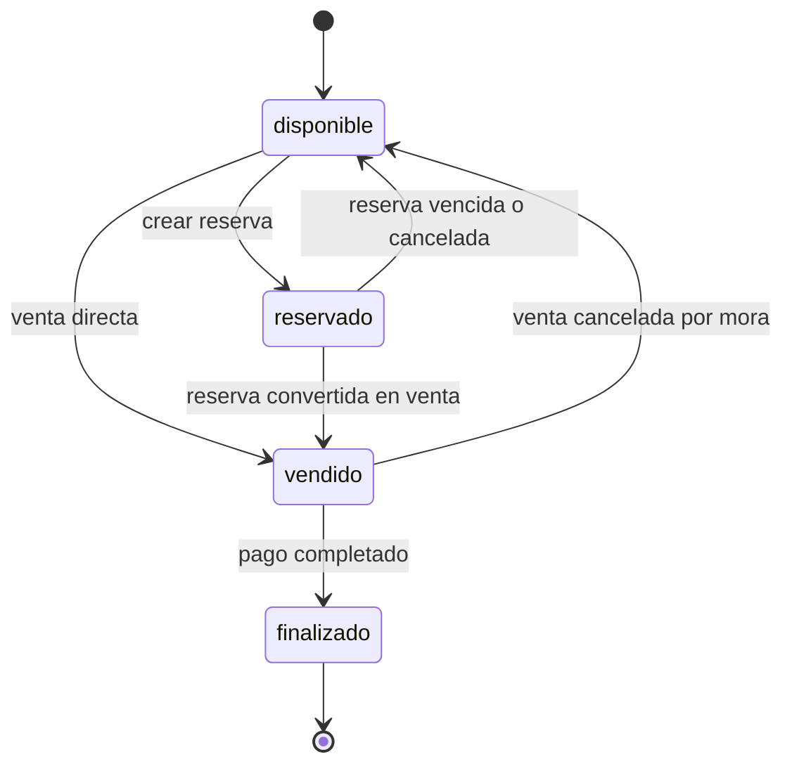

# Plan de implementacion: maquina de estados del lote

## Objetivo

Implementar la issue [#54](https://github.com/LoteoApp/LoteosAPP/issues/54)
como una capacidad de dominio y persistencia reutilizable por Reservas, Ventas y
Cobranza. Cada lote debe tener un unico estado vigente, un historial inmutable y
transiciones atomicas que impidan reservar o vender dos veces el mismo lote ante
solicitudes concurrentes.

Este plan toma `develop` como linea base. El PR
[#178](https://github.com/LoteoApp/LoteosAPP/pull/178) aporta seleccion y edicion
desde el plano, pero no es una dependencia del motor de estados. La integracion
visual sobre ese panel debe hacerse despues de mergear o rebasar sobre `#178`.

## Fuentes revisadas

- `docs/domain.md`: Reservas, Venta, reglas de mora y ciclo de vida del lote.
- `docs/architecture.md`: limites de capas, casos de uso, gateways, handlers y
  DTOs por feature.
- `docs/database.md`: migraciones Goose, historial append-only y uso de
  PostgreSQL/Supabase.
- `migrations/00005_create_entity_model.sql`: tablas `lotes`, `reservas`,
  `reserva_estados`, `ventas`, `venta_estados` y `lote_estados`.
- Implementacion actual de loteos en `internal/business` y
  `internal/infrastructure/repository/postgres`.
- Documentacion vigente de Supabase sobre RLS y changelog, sin cambios que
  alteren este diseño.
- Documentacion oficial de `pgx/v5`, Goose y PostgreSQL sobre transacciones,
  migraciones SQL y bloqueos de fila. Context7 no estaba disponible en la
  sesion; se usaron las fuentes primarias como alternativa.

## Compatibilidad de dependencias

La implementacion no requiere dependencias nuevas:

- `github.com/jackc/pgx/v5 v5.10.0` ya ofrece las transacciones y operaciones
  necesarias. El repositorio debe conservar el patron explicito de `Begin`,
  `defer Rollback` y `Commit`: cancelar el contexto de `pgx` no revierte por si
  solo una transaccion abierta.
- El proyecto usa `github.com/pressly/goose/v3 v3.27.3`. Existe `v3.28.0`, pero
  el plan solo necesita capacidades ya presentes: migraciones transaccionales
  por defecto y bloques `-- +goose StatementBegin` / `StatementEnd` para
  funciones PL/pgSQL. La actualizacion debe evaluarse en una tarea de
  dependencias separada y no mezclarse con `#54`.
- PostgreSQL aporta `SELECT ... FOR UPDATE`, constraints y triggers; no hace
  falta una libreria Go de maquina de estados ni advisory locks.
- Supabase no requiere SDK adicional. El frontend sigue leyendo por el backend
  con su cliente HTTP actual; `@supabase/supabase-js` solo mantiene la sesion.
- No se agrega un scheduler en `#54`. La decision entre un worker del backend y
  `pg_cron` corresponde a `#34/#35`, cuando se implemente la expiracion.

## Estandares de implementacion

### Idioma del codigo

El codigo debe escribirse completamente en ingles: nombres de archivos,
paquetes, tipos, interfaces, funciones, metodos, variables, constantes,
comentarios y nombres de tests. Los mensajes visibles para la persona usuaria y
los mensajes de errores de dominio que forman parte del contrato HTTP permanecen
en espanol, de acuerdo con el idioma de la aplicacion.

### Calidad del codigo

- Mantener funciones pequenas, nombres precisos y dependencias explicitas.
- Respetar los limites de arquitectura: el dominio y los casos de uso no pueden
  depender de HTTP, PostgreSQL, `pgx` ni implementaciones concretas.
- Representar estados y transiciones con tipos del dominio, evitando strings
  dispersos y comparaciones duplicadas.
- Devolver errores esperados como `*domain.Error`, con `Kind`, `Code`, `Message`
  y `Cause` cuando exista un error subyacente.
- No agregar comentarios narrativos; aclarar solamente reglas o restricciones
  que no resulten evidentes en el codigo.
- Mantener los umbrales de cobertura y dar al motor de transiciones al menos
  90 % por tratarse de una regla critica.
- No agregar abstracciones, paquetes o dependencias sin un uso concreto dentro
  de la entrega.

### Tolerancia a fallos

- Ejecutar cada cambio de estado y su operacion comercial asociada en una sola
  transaccion: ante cualquier fallo, no debe persistirse un estado parcial.
- Usar el estado esperado y bloqueo de fila para convertir carreras concurrentes
  en conflictos de dominio predecibles.
- Hacer las operaciones automaticas idempotentes, de modo que puedan reintentarse
  despues de un timeout o una interrupcion sin duplicar eventos.
- Propagar la cancelacion del contexto a todas las consultas y ejecutar siempre
  un rollback explicito cuando la transaccion no se confirma.
- Mantener las transacciones cortas y no realizar llamadas de red mientras se
  conserva un lock.
- Ocultar fallos inesperados tras el error generico correspondiente y registrar
  la causa sin exponer datos internos al cliente.
- Tratar una respuesta ambigua por timeout como estado desconocido: volver a
  consultar el lote antes de reintentar una transicion.
- Cubrir fallos de conexion, commit, constraints, actor inexistente, lote dado de
  baja y estado esperado obsoleto.

### Reutilizacion

- Mantener una unica matriz de transiciones en `domain`; Reservas, Ventas y
  Cobranza deben usarla en lugar de redefinir sus propias reglas.
- Compartir el fake del gateway desde `internal/business/gateway/gatewayfake`.
- Encapsular en el adaptador PostgreSQL la lectura bloqueada, insercion del evento
  y mapeo de errores comunes para que los repositorios comerciales puedan
  reutilizar el mismo comportamiento dentro de sus transacciones.
- Reutilizar en frontend un unico componente accesible de etiqueta de estado en
  la tabla de lotes y en el panel del lote seleccionado.
- Reutilizar los patrones existentes de autenticacion, `apiFetch`, manejo de
  errores, DTOs y `handler.Adapt`; no crear clientes HTTP ni mapeadores paralelos.
- Evitar una abstraccion generica para todas las maquinas de estado del sistema:
  lote, reserva y venta tienen reglas y efectos distintos. Compartir piezas
  concretas solo cuando exista repeticion real.

## Estado actual y brechas

La migracion `00005` ya crea `lote_estados` con los valores `disponible`,
`reservado`, `vendido` y `finalizado`, pero la funcionalidad esta incompleta:

- `lotes` no tiene un campo de estado vigente;
- al crear un lote no se inserta el estado inicial `disponible`;
- no se impide actualizar o borrar el historial;
- no se validan las transiciones entre estados;
- no hay una operacion atomica y segura ante concurrencia;
- el detalle y el listado de loteos no exponen el estado;
- el historial no indica si la transicion provino de una reserva, una venta o
  una correccion administrativa;
- las tablas tienen RLS habilitada, pero el acceso de la aplicacion sigue
  pasando por el backend y el rol de conexion documentado en `docs/database.md`.

## Modelo propuesto

### Estados



`finalizado` es terminal. No se habilita un endpoint generico que permita elegir
cualquier estado; cada flujo de negocio solicita una transicion concreta y el
motor valida el par origen/destino.

### Estado vigente e historial

Agregar una nueva migracion Goose, sin modificar `00005`, que:

1. agregue `lotes.estado_actual TEXT NOT NULL DEFAULT 'disponible'` con un
   `CHECK` para los cuatro valores;
2. inserte una fila inicial `disponible` en `lote_estados` para cada lote que
   todavia no tenga historial;
3. agregue un trigger `AFTER INSERT ON lotes` que cree el estado inicial para
   los lotes futuros;
4. agregue un trigger que proteja `lotes.estado_actual` contra cambios directos;
5. agregue un trigger `AFTER INSERT ON lote_estados` que actualice el estado
   vigente;
6. reutilice `estado_historial_reject_mutation()` para rechazar `UPDATE`,
   `DELETE` y `TRUNCATE` sobre `lote_estados`;
7. agregue un indice compuesto `lote_estados (lote_id, fecha_creacion DESC, id
   DESC)` para consultar el historial de un lote en orden estable;
8. agregue `origen`, `razon`, `reserva_id` y `venta_id` para conservar la
   trazabilidad aprobada. Las referencias son nullable y se completan cuando la
   transicion proviene de una reserva o una venta. `razon` es obligatoria para
   cancelaciones manuales y correcciones futuras.

Materializar el estado vigente sigue el patron ya usado por `reservas` y
`ventas`. El historial conserva la auditoria; `lotes.estado_actual` permite
filtrar disponibilidad sin una consulta lateral al ultimo evento.

El `Down` debe retirar triggers, funciones, indices y columnas agregados por esta
migracion. Como el rollback elimina informacion historica creada despues del
`Up`, debe documentarse como destructivo y usarse solo en desarrollo.

## Dominio y contratos

Crear `internal/business/domain/lote_state.go` con:

- `type LoteState string`;
- constantes para los cuatro estados;
- `CanTransitionTo(next LoteState) bool` o una funcion equivalente;
- `LoteStateTransition` con lote, origen, destino, actor, fecha y trazabilidad;
- errores `*domain.Error`: estado invalido, transicion invalida, conflicto por
  estado actual y lote inexistente.

Extender `domain.Lote` y, si el producto lo requiere, `LoteoSummary` con el
estado vigente. El negocio no debe importar `pgx`, SQL ni tipos HTTP.

Crear el contrato bajo `internal/business/gateway`, junto con su fake reusable.
La operacion principal debe expresar compare-and-set:

```go
Transition(ctx context.Context, command domain.LoteStateTransition) (domain.LoteStateEvent, error)
```

El comando incluye el estado esperado. Si otra transaccion gano la carrera, el
repositorio devuelve un conflicto de dominio en vez de sobrescribir el cambio.

## Caso de uso

Crear un caso de uso de una sola operacion en
`internal/business/usecase/loteos/transition_lote_state.go`:

1. valida identificadores y estado solicitado;
2. resuelve al actor a partir del `auth_provider_id` cuando la transicion es
   humana;
3. valida el rol y el alcance del loteo;
4. valida la transicion con las reglas del dominio;
5. llama al gateway con estado esperado;
6. traduce fallos de infraestructura a `*domain.Error` sin exponer causas.

No debe publicarse inicialmente como un PATCH generico. Reservas y Ventas deben
invocar la misma regla desde sus casos de uso, pero persistir la entidad y el
cambio de lote dentro de una unica transaccion de repositorio. Esto evita el
estado imposible de una reserva activa con un lote disponible, o una venta
creada con el lote aun reservado.

Para evitar duplicar logica, la matriz de transiciones vive en `domain`. Los
repositorios de Reservas y Ventas usan esa regla antes de ejecutar su transaccion
y las restricciones de base actuan como ultima defensa.

## Persistencia y concurrencia

Implementar el adaptador PostgreSQL con una transaccion corta:

1. bloquear el lote objetivo mediante `SELECT ... FOR UPDATE`;
2. leer `estado_actual` y verificar que coincida con el esperado;
3. insertar el evento en `lote_estados`;
4. dejar que el trigger actualice `lotes.estado_actual`;
5. releer el resultado y confirmar la transaccion.

El adaptador siempre difiere un `Rollback` inmediatamente despues de abrir la
transaccion y ejecuta `Commit` de forma explicita. Esto cubre errores y
cancelaciones de contexto sin dejar conexiones `idle in transaction`.

El bloqueo siempre se adquiere primero sobre `lotes` y luego sobre la entidad
comercial asociada. Reservas, Ventas y procesos automaticos deben respetar ese
orden para evitar deadlocks. No se hacen llamadas HTTP, a Supabase Auth ni a
otros servicios mientras se mantiene el lock.

La base debe rechazar tambien una transicion cuyo estado de origen ya no sea el
esperado. El indice unico de reserva activa sigue siendo una defensa adicional,
pero no reemplaza el lock porque reserva y estado del lote deben cambiar juntos.

## API y frontend

El primer incremento expone el estado como dato de lectura:

- agregar `estado` a cada lote de `GET /api/v1/loteos/{loteoId}`;
- evaluar agregar conteos por estado al listado de loteos solo si existe un caso
  concreto de UI;
- actualizar DTOs, validacion del cliente TypeScript y tipos de la feature;
- mostrar una etiqueta de estado en la tabla de lotes;
- integrar la misma etiqueta y las acciones contextuales en el panel del PR
  `#178` cuando esa base este disponible.

Las acciones deben pertenecer a sus flujos: `Reservar`, `Concretar venta`,
`Cancelar reserva` o `Registrar pago final`. No se ofrece un selector libre de
estado al usuario.

El alcance de `#54` solo muestra el estado. Los botones y formularios que
originan transiciones se agregan con Reservas, Ventas y Cobranza.

## Autorizacion

La autorizacion se valida en los casos de uso que originan la transicion:

- reservar: inmobiliaria asignada al loteo, administrativo o administrador;
- cancelar una reserva antes de su vencimiento: el mismo vendedor responsable,
  la inmobiliaria responsable, un administrativo o un administrador, siempre
  con justificacion;
- venta directa o conversion: segun las reglas de la epica Venta;
- vencimiento y mora: proceso interno autenticado por configuracion, sin fingir
  un usuario humano;
- finalizacion: proceso de cobranza al confirmarse el pago completo.

`usuario_modificacion` permanece nullable para procesos automaticos. Si se
necesita distinguir sistema de dato historico desconocido, la trazabilidad debe
modelarlo expresamente y no inferirse solo por un `NULL`.

No se crea una funcion `SECURITY DEFINER`, RPC publica ni acceso directo desde el
frontend. Las tablas nuevas o alteradas conservan RLS y los permisos existentes;
la escritura sigue pasando exclusivamente por el backend. Si en el futuro se
expone alguna operacion mediante la Data API de Supabase, debe agregarse una
revision separada de grants y politicas RLS con pruebas de allow/deny.

Un cliente puede pedir la cancelacion porque se arrepintio, pero no opera la
aplicacion directamente. Uno de los actores autorizados registra la cancelacion
y deja la justificacion obligatoria. El vendedor tambien puede cancelarla si se
equivoco de lote al cargarla. La razon debe conservar el motivo concreto; el
origen del evento sigue siendo `reserva` y el usuario que lo registro queda en
`usuario_modificacion`.

## Pruebas

### Dominio

- todas las transiciones permitidas;
- todos los saltos prohibidos, incluyendo salir de `finalizado`;
- estados desconocidos.

### Caso de uso

- exito por cada rol permitido;
- rol prohibido y actor no aprovisionado;
- lote inexistente o fuera del alcance;
- estado esperado distinto del vigente;
- propagacion segura de errores de base.

### Handler y DTO

- estado presente en el detalle del loteo;
- forma JSON y estados HTTP observables;
- autenticacion, autorizacion, identificadores invalidos y conflictos.

### Repositorio PostgreSQL

- backfill de lotes existentes;
- estado inicial automatico en lotes nuevos;
- historial append-only;
- proteccion contra UPDATE directo de `lotes.estado_actual`;
- transicion valida actualiza vigente e historial en la misma transaccion;
- transicion invalida o estado esperado obsoleto no escribe nada;
- dos intentos concurrentes `disponible -> reservado`: exactamente uno gana;
- rollback conjunto cuando falla la creacion de reserva o venta;
- orden estable del historial.

### Frontend

- muestra del estado recibido;
- etiqueta accesible en tabla y panel;
- acciones visibles segun estado y permisos;
- actualizacion del estado despues de una operacion exitosa;
- conflicto concurrente mostrado con un mensaje accionable y refresco del lote.

Mantener los umbrales definidos en `AGENTS.md`, con al menos 90 % para la matriz
de transiciones por ser una regla critica. Agregar los paquetes nuevos al comando
raiz `test:backend:coverage`.

## Entregas propuestas

### Entrega 1: nucleo de estados (#54)

- migracion, backfill, triggers e indices;
- dominio, gateway, fake y repositorio;
- lectura del estado en el detalle de loteo;
- etiqueta de estado en la UI disponible en `develop`;
- pruebas unitarias, HTTP, integracion y concurrencia;
- actualizacion de `docs/domain.md`, `docs/database.md`, `docs/architecture.md` y
  `docs/testing.md`.

### Entrega 2: reservas (#33)

- crear reserva y transicionar `disponible -> reservado` atomicamente;
- integrar seleccion de cliente, vendedor y lote;
- impedir reservas duplicadas con respuesta de conflicto.

### Entrega 3: vencimiento y cancelacion (#34 y #35)

- marcar reserva vencida/cancelada y transicionar `reservado -> disponible` en
  la misma transaccion;
- permitir cancelacion anticipada por solicitud del cliente o error del
  vendedor, con autorizacion y justificacion obligatoria;
- ejecucion periodica idempotente y segura con multiples instancias.

### Entrega 4: ventas y cobranza

- `disponible -> vendido` y `reservado -> vendido`;
- `vendido -> disponible` por cancelacion;
- `vendido -> finalizado` al completar el pago.

## Verificacion antes de finalizar cada entrega

- `go test ./...` y `go vet ./...` desde `apps/backend`;
- comandos frontend de typecheck, lint, test y build cuando cambie la UI;
- `pnpm test` y `pnpm test:coverage` desde la raiz;
- `docker compose config` para validar configuracion, aunque el desarrollo se
  ejecute de forma nativa;
- migracion `Up` sobre PostgreSQL real, verificacion de constraints/triggers y
  `Down` solo sobre una base descartable;
- prueba manual de dos solicitudes simultaneas sobre el mismo lote.

## Decisiones de negocio confirmadas

1. Una reserva activa puede cancelarse manualmente antes de los 15 dias por
   solicitud del cliente o porque el vendedor eligio el lote equivocado. Puede
   registrarlo el mismo vendedor responsable, la inmobiliaria responsable, un
   administrativo o un administrador. La justificacion es siempre obligatoria.
2. `#54` no incluye correccion manual de estado. Si aparece una necesidad
   operativa concreta, se implementara como un flujo auditado separado. El valor
   de origen `correccion` queda reservado para ese flujo y no habilita por si
   mismo ninguna operacion.
3. Cada evento registra `origen` (`alta`, `reserva`, `venta`, `cobranza`,
   `sistema`, `correccion`), `razon` y referencias nullable a `reserva_id` y
   `venta_id` cuando correspondan.
4. El frontend de `#54` solo muestra el estado. Las acciones operativas llegan
   con las funcionalidades de Reservas, Ventas y Cobranza.

## Criterios de aceptacion de #54

- todo lote existente y nuevo tiene estado inicial `disponible`;
- solo se aceptan las transiciones del diagrama aprobado;
- el estado vigente y el historial nunca divergen;
- el historial es inmutable y auditable;
- las cancelaciones anticipadas requieren actor autorizado y justificacion;
- dos operaciones concurrentes no pueden adjudicarse el mismo lote;
- el detalle del loteo informa el estado de cada lote;
- no existe un endpoint generico para forzar estados arbitrarios;
- los errores esperados son `*domain.Error` y no filtran causas internas;
- pruebas y cobertura cumplen los umbrales del repositorio.
